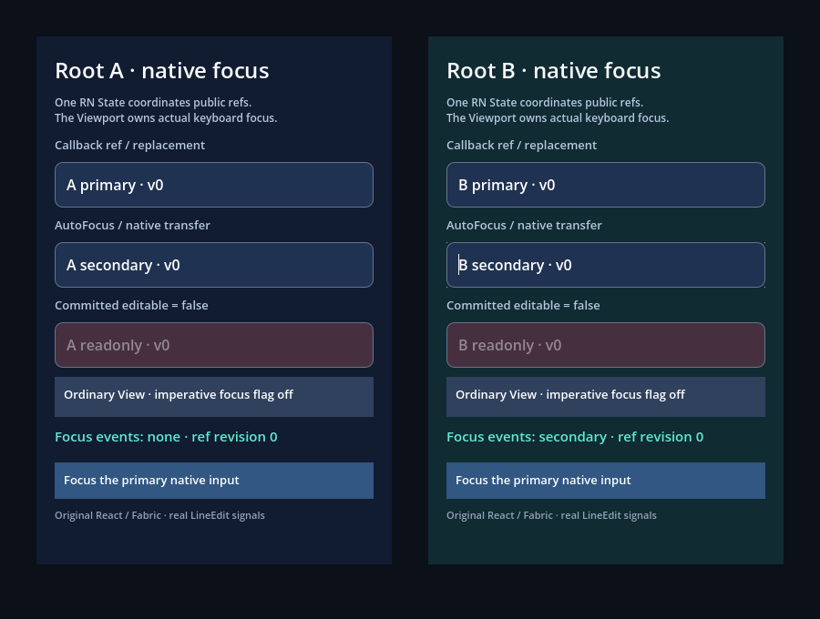

# Original TextInputState and native focus

```sh
npm run example -- focus
npm run example -- focus --headless
npm run example -- focus --capture
```

Two public `FocusPanel` roots share one Hermes application and the original
React Native input registry. Root A focuses from its callback ref. Validation
then mounts B and exercises `autoFocus`, ref methods, the four public
`TextInput.State` methods and original Codegen commands.

The fixture compares the public/original singleton with the actual Viewport
focus owner and every LineEdit's `has_focus()`. Native transfers use real Godot
`grab_focus()` and signals. This is not a hardware keyboard or mobile IME test.

It covers repeated/unfocused commands, declared and native editability changes,
callback ref replacement, key replacement, focused removal and retained refs.
A wrapper loses its `nativeID`, reparenting the same input. A `tree_exited`
callback attempts focus during that off-tree interval. Separate `focus_entered`
callbacks retire root A and stop the application while the original command
is still executing. Registry, focus, callbacks and native resources must all
agree after cleanup.

Ordinary View refs keep original prototype focus/blur behavior with RN's
imperative View focus flag disabled. Full HostInstance, hidden trees, keyboard
navigation, IME, multiline and mobile reference comparisons remain open.




[Executed results and limits](../../docs/evidence/focus/README.md).
