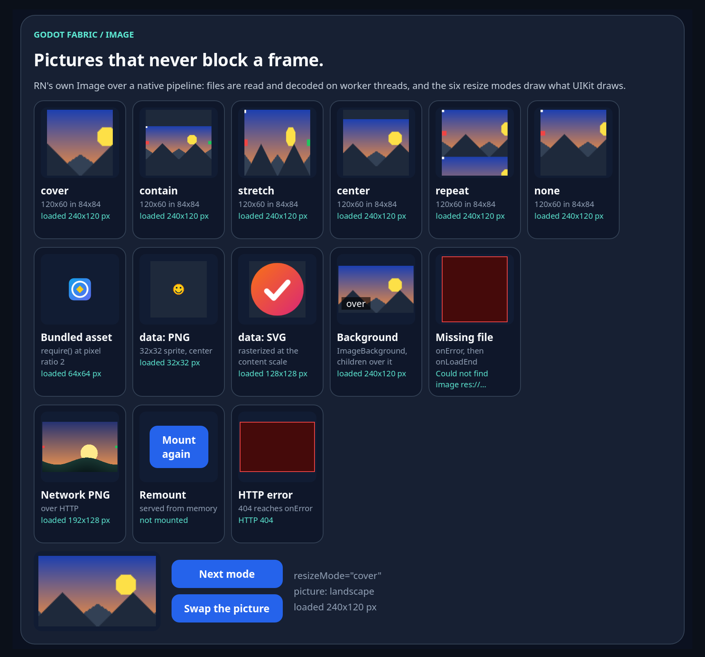
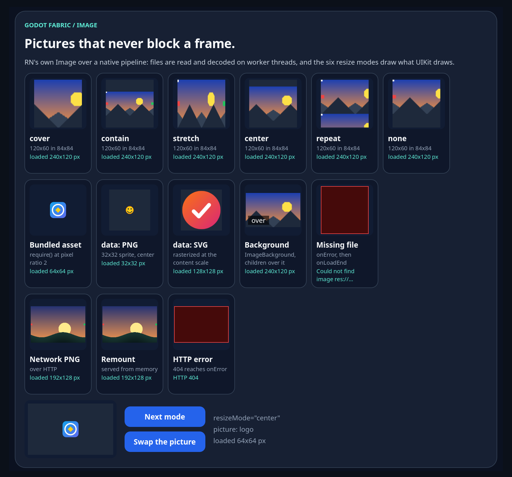

# Image

```sh
npm run example -- images
npm run example -- images --headless
npm run example -- images --capture
npm run test:images
npm run test:images-network
```

The public `Image`, `ImageBackground`, `Animated.Image` and `AssetRegistry` are React Native's
originals: `Image.ios.js`, `ImageBackground.js`, `AnimatedImage.js` and the asset registry that
Metro's asset modules register in. Because Godot is not Android, `Image` takes its iOS-family
path: the generated `RCTImageView` component, its `onLoadStart`, `onProgress`, `onLoad`,
`onError` and `onLoadEnd` events, and the `ImageLoader` TurboModule for `getSize`, `prefetch` and
`queryCache`. The native
half is React Native's own C++ image pipeline (`ImageShadowNode`, `ImageRequest` and the observer
coordinator) over a host `ImageManager`: every request is read and decoded on Godot's
`WorkerThreadPool`, never on the main thread, and a `GodotImage` view draws the texture in the
content frame with the six resize modes UIKit maps (`RCTImagePrimitivesConversions.h`). `http(s)`
sources download over the loader's own HTTP transport with RN iOS's request and failure semantics,
and two memory caches (a decoded-picture cache in the role of `RCTImageCache` and a byte cache in the
role of `NSURLCache`) decide where a picture comes from; the
[network evidence](../../docs/evidence/images-network/README.md) lists every departure from iOS.

The launcher entry is the interactive demo: the six resize modes of one bundled landscape; a logo
with `@1x`, `@2x` and `@3x` files, which RN's `pickScale` chooses between by the content scale; a
PNG and an SVG as `data:` URIs; an `ImageBackground` with a child over the picture; a picture that
does not exist and fails through `onError`; and a preview that two buttons change (the next resize
mode, and the picture itself). A row of network pictures comes from a small HTTP server that the scene
starts on loopback, so that the example needs no network and no other process: a PNG the server
draws, downloaded and decoded as 192x128 pixels in a 96x64 point frame; a `Remount` card whose button
mounts a second Image of the same address and size, which the decoded cache answers without a second
request; and an address the server answers 404 for, whose status reaches `onError`. The example runs
at a content scale of 2, so the `@2x` logo is the file RN picks and the texture has its 64 pixels for a
32 point layout.

## What the validation establishes

[validation.gd](validation.gd) sends real Godot mouse input and reads each picture from the native
`GodotImage` that shows it, from what JS observed and, with `--capture`, from the renderer's frame.
It checks that the example mounts fourteen Images and two buttons (a third button waits for the click
that mounts a fifteenth) and that every picture that exists loads; that `pickScale` chooses `logo@2x.png` at a pixel ratio of 2 and the texture has that file's
64x64 pixels while its layout is the asset's 32x32 points; that each of the six resize modes draws
the rectangles UIKit draws for a 120x60 point picture in an 84x84 point frame (repeat tiles at the
picture's size in points); that the `data:` PNG is shown at its size in points and the `data:` SVG
is rasterized at the content scale; that the `ImageBackground` draws its picture under its `Text`
child; that the missing picture fails through `onError`, leaves no texture and shows why; that JS
saw `loadStart`, `load` and `loadEnd` for each picture and `loadStart`, `error` and `loadEnd` for
the missing one; and that the loader's own record shows all fourteen pictures asked for, the twelve
that exist read and decoded on worker threads, twelve loaded and two failed. For the network row it
checks that the PNG the server drew is downloaded and decoded as 192x128 pixels at scale 2 and fills
its frame, that JS saw `loadStart`, `progress` up to the whole body, `load` and `loadEnd` while the
server was asked once, that the downloaded bytes were decoded on a worker thread, and that the 404
fails through `onError` with `Failed to load <URL>`, the status and the response headers, leaves no
texture and shows `HTTP 404`. Six real clicks take the preview through the six resize modes,
redrawing it each time and loading nothing; a click on the second button swaps the picture, which is
a new request with one `loadStart` and one `load`; and a mouse press on `Mount again` mounts the
second Image, which the decoded cache answers: the server is still asked once, no progress is
reported, the two Images share one picture and no texture is created. Stopping the application
awaits every worker task and leaves no texture. With `--capture`, the renderer's frame shows the
left-edge mark in stretch, contain and repeat and crops it out in cover and center, draws `none`
at the top-left corner with the bottom of the frame bare, and the six tiles have six different
digests. The headless run passes 22 checks and the capture run 30.

## Captures

`npm run example -- images --capture` saves two frames of the native renderer at the example's
content scale of 2 (1800 x 1676 pixels for the 900 x 838 point window). The
[network evidence](../../docs/evidence/images-network/README.md) keeps their SHA-256 in `report.json`;
the two frames of the first slice, taken before the network row existed, stay in the
[first record](../../docs/evidence/images/README.md).



**The six modes, the sources and the network row.** One 120x60 point landscape in 84x84 point frames:
`cover` crops the red and green marks off the edges, `contain` shows all of it between two bars,
`stretch` distorts it, `center` shows its middle at natural size, `repeat` tiles it at its size in
points and `none` draws it at the top-left corner with the bottom of the frame bare. Below them: the
logo from its `@2x` file (64x64 pixels for a 32 point layout), the 32x32 pixel PNG sprite centered, the
SVG rasterized at 128x128 pixels, the `ImageBackground` with its `over` text on the picture, and the
missing file as a dark red box with its error. The last row is the network: `Network PNG`, the picture
the example's server draws, downloaded and decoded as 192x128 pixels in a 96x64 point frame
(`loaded 192x128 px`); `Remount`, which holds the `Mount again` button and reads `not mounted`; and
`HTTP error`, the server's 404 as a dark red box whose card reads `HTTP 404`. The preview is in `cover`
and reads `loaded 240x120 px`.



**After the clicks.** Nine real clicks on `Next mode` took the preview through every mode and on to
`center`, a click on `Swap the picture` loaded the logo and a press on `Mount again` mounted a second
Image of the sunrise: the `Remount` card shows it again, `loaded 192x128 px`, answered by the decoded
cache with no second request to the server. The preview shows the logo in `center`, with
`resizeMode="center"`, `picture: logo` and `loaded 64x64 px`, while the other cards stay as they were.

## Evidence suite

```sh
npm run test:images
```

With the preceding native host installed, the runner checks the control:

```sh
node tests/images-native.test.mjs --allow-original-negative
```

and `node scripts/images-sabotage.mjs` runs the retained sabotages (decoding on the main thread,
and a view that keeps listening to a request it swapped away from). The network row is the example's
slice of a larger suite, `npm run test:images-network`, which drives a Node server on loopback through
the failures, the progress, the cancellation, the limits and the two caches; its control runs with
`node tests/images-network-native.test.mjs --allow-original-negative` on the preceding host and its
three retained sabotages with `node scripts/images-network-sabotage.mjs`.

## Original syntax

```jsx
import {Image, ImageBackground} from 'react-native';

export function Cover() {
  return (
    <ImageBackground source={require('./cover.png')} resizeMode="cover" style={{width: 320, height: 180}}>
      <Image source={{uri: 'data:image/png;base64,iVBOR...'}} style={{width: 48, height: 48}} />
    </ImageBackground>
  );
}
```

A `require()`d image is the module Metro makes of it: `npm run bundle` and the SDK builder register
every `@Nx` variant with the asset registry and copy the files beside the bundle with a
`<bundle>.assets.json` manifest. Sources are `require()` assets, `res://`, `user://`, absolute
`file://`, `data:` and `http(s)` URIs; PNG, JPEG, WebP, BMP, TGA and SVG decode, and GIF or anything
else fails through `onError`. A network source takes RN's `headers`, `method`, `body` and `cache`
(`reload`, `force-cache` or `only-if-cached`):

```jsx
<Image source={{ uri: 'https://example.com/cover.png', headers: { Authorization: token }, cache: 'force-cache' }} />
```

`Image.prefetch(url)` downloads into the byte cache and `Image.queryCache([url])` answers `memory` for
what it holds.

## Limits

`tintColor`, `blurRadius`, `capInsets`, `defaultSource`, `loadingIndicatorSource`, `fadeDuration`,
`progressiveRenderingEnabled`, `resizeMethod`, `resizeMultiplier`, `overlayColor` and a border radius
on the image's own style fail where the Image renders, naming the later slice. Network images have
no disk cache, revalidation, cookies, compression or HTTP/2, and the example's server is a loopback
GDScript one; animated GIF and WebP, and desktop and Android export of assets are not delivered yet.
