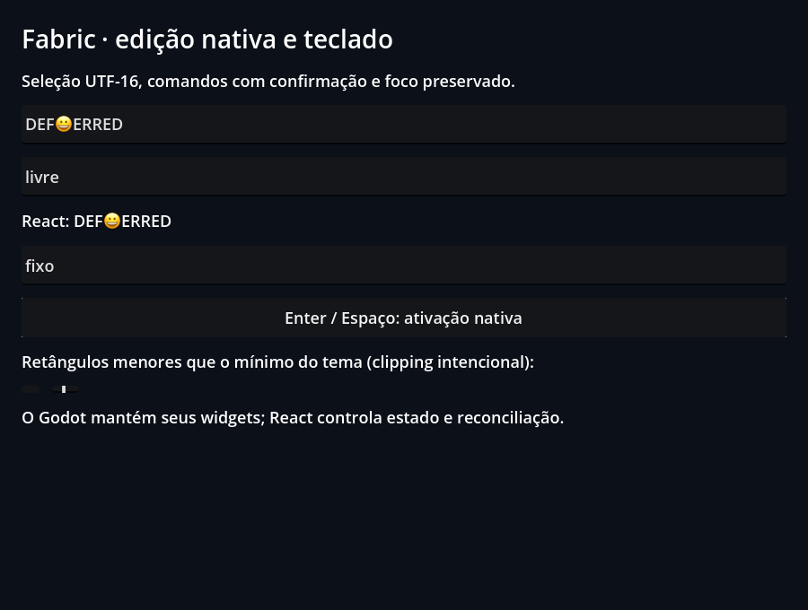

# Controlled native editing

[Application](App.jsx) · [Godot scene](scene.tscn) · [Examples index](../README.md)

Type into the fields and use the controls to transform values and change focus.
The fixture includes explicit native dimensions and selection observations.

## Run

From the repository root after `npm run setup`:

```sh
npm run example -- input
npm run example -- input --headless
npm run example -- input --capture
```

The first command opens the UI; the others validate and exit. Edit `App.jsx`,
close the window and rerun to rebuild. Reports use `build/report.json`.
Captures use `build/input.png` (renderer readbacks). Retained public results
are in [evidence](../../docs/evidence/README.md).

## Contract and validation

Internal `TextInput` maps to Godot LineEdit. The public `react-native` TextInput
export is unavailable. Logical Unicode events do not certify desktop IME or
mobile keyboard behavior.

Controlled updates, stale acknowledgements, selection, key/focus events, native
geometry and cleanup. The harness sends logical Viewport keyboard events.
The native checks additionally require the acceptance marker and reject script
errors, runtime errors, crashes and timeouts. Generated reports are local and
are overwritten by another individual check.

## Renderer captures

These are Godot Viewport readbacks from the [current validation record](../../docs/evidence/public-controls/README.md).


