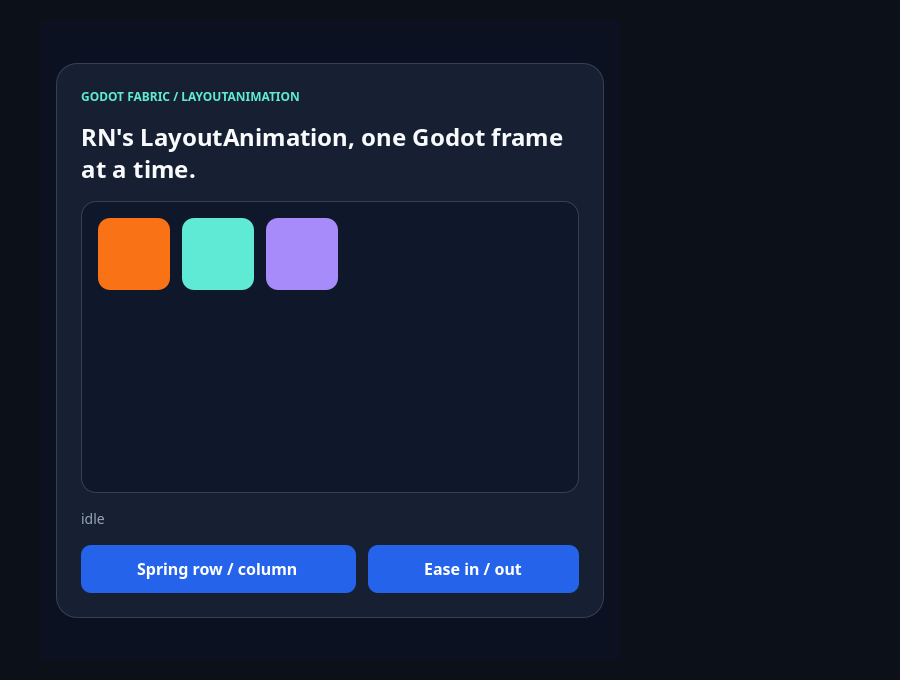
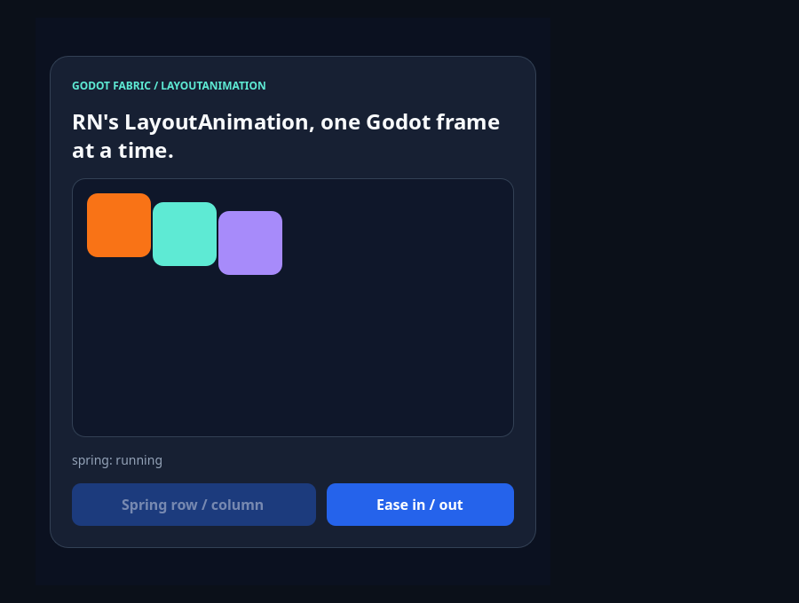
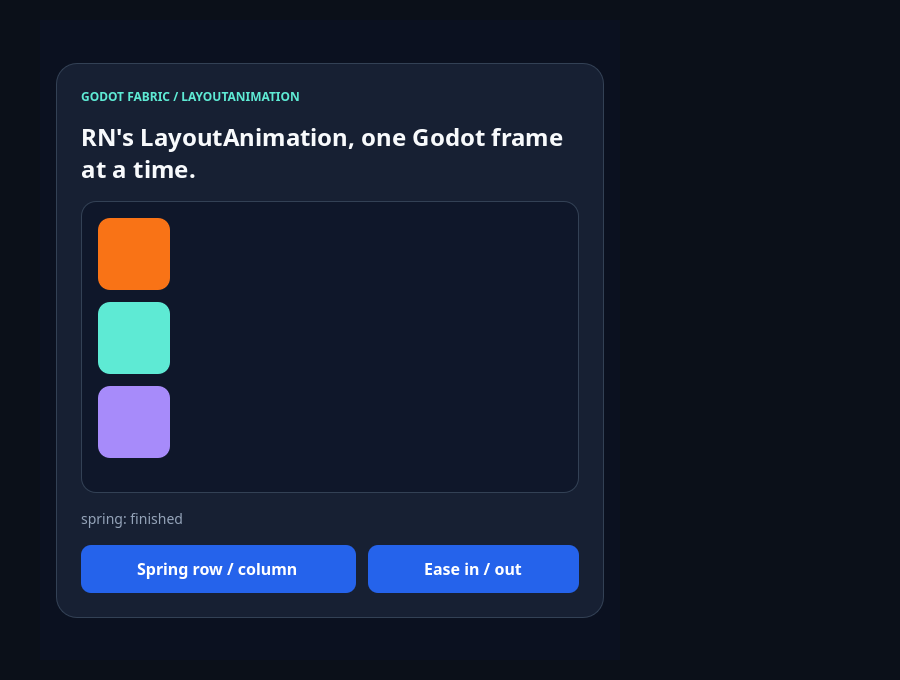
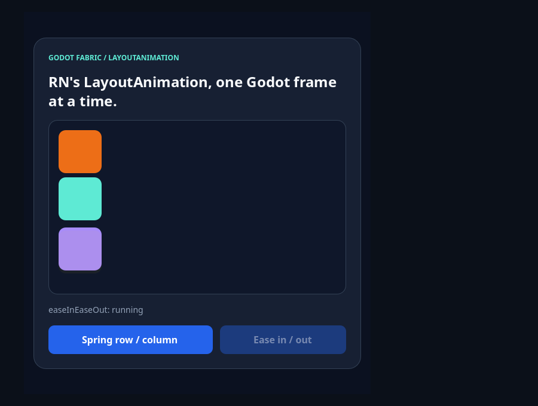
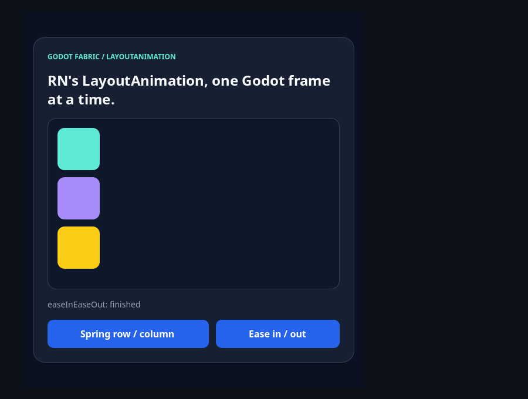

# LayoutAnimation

```sh
npm run example -- layout-animation
npm run example -- layout-animation --headless
npm run example -- layout-animation --capture
npm run test:layout-animation
```

RN's original `LayoutAnimation` through the public `react-native` import. `configureNext`
arms the commit that follows, and RN's own C++ `LayoutAnimationDriver`, which the host
installs on the `UIManager`, turns that commit's mutations into frames: one per tick of the
host's [frame clock](../../docs/research/frame-clock.md), the same ticks that pace
`requestAnimationFrame` and the native `Animated`. The three tiles move, appear and disappear
without a React commit per frame; the Controls change on every tick and only the root
re-renders, when a button is pressed and when RN calls `onAnimationDidEnd`. The two buttons are
`TouchableOpacity`. The launcher entry is the interactive demo; `npm run test:layout-animation`
is the [evidence](../../docs/evidence/layout-animation/README.md) suite, outside the catalog.

## Use the example



**Idle** is the three tiles in a row, one tile and a gap apart, with the status `idle`. RN's driver is
installed and has served no transaction, and React has rendered once.

**Spring row / column** calls `LayoutAnimation.configureNext(LayoutAnimation.Presets.spring)` and flips the
stage's `flexDirection`. Yoga lays the three tiles out in their new places at once (`onLayout`, `measure` and the
shadow tree report the column immediately); the driver shows the move over 700 ms along RN's spring curve, which
overshoots before it settles, so the tiles swing past their places and back.



**Mid-spring** is the first frame in which the third tile has moved more than 8 points and the driver is in flight,
three ticks in: the first tile has not moved, the other two have left the row, about 10 and 20 points toward the
column, and the status reads `spring: running`. The frame is early in the animation, and the instant it catches
changes from one run to the next.



**After the spring** the tiles rest in a column, exactly where Yoga laid them out, 84 points apart, and the status
is `spring: finished`. React rendered three times (mount, request, end), not once per frame.

**Ease in / out** calls `Presets.easeInEaseOut` and replaces the first tile with a fourth. The new tile is created
at opacity 0 and fades in while the old one, which stays mounted, fades out; the two in the middle slide into the
gap. Only when the 300 ms animation ends does the host remove the old tile.



**Mid-ease** is the first frame in which both opacities are between 5% and 95%: the orange tile that is leaving is
still mounted at about 95%, the two in the middle have started up (the gap under the first tile is 7 points instead
of 12), and the yellow tile that is entering, in the third place, is at about 5%. The status reads
`easeInEaseOut: running`.



**After the ease** the orange tile is gone, removed by the animation's last transaction, and the cyan, purple and
yellow tiles rest in a column, the yellow one opaque; the status is `easeInEaseOut: finished`.

Pressing **Spring** again returns the tiles to a row. The status line follows the callbacks: `running` is set in the
same commit that is animated and `finished` when RN calls `onAnimationDidEnd`.

## What the validation establishes

[validation.gd](validation.gd) sends actual Godot mouse input and reads the Controls the driver
updated. It checks that the example mounts the three tiles and the two buttons, that before
any animation the tiles rest in a row one tile and a gap apart and the driver is installed and
idle, that mid-spring the third tile is neither in the row nor in the column, that RN reports
the end once and the tiles rest exactly in the column Yoga laid out, that React rendered three
times by then (mount, request, end), that mid-ease the new tile fades in while the old one,
still mounted, fades out with their opacities adding up to one, that the old tile is removed
only at the end, that the third animation returns the tiles to a row, and that three animations,
three callbacks and seven renders and no host error are all there is. Stopping the application
releases the driver without an error, and with `--capture` the pixels of the stage differ at rest,
in both mid-animation frames and at both ends. The [probe](../../tests/layout-animation-probe.gd)
and its independent oracle cover every frame of every animation.

## Original syntax

```jsx
import {LayoutAnimation} from 'react-native';

function onPress() {
  LayoutAnimation.configureNext(
    LayoutAnimation.Presets.spring,
    () => console.log('finished'), // onAnimationDidEnd
    () => console.log('rejected'), // onAnimationDidFail: only if RN cannot parse the config
  );
  setDirection(direction === 'row' ? 'column' : 'row'); // the commit that is animated
}
```

| Piece | Who runs it |
| --- | --- |
| `configureNext`, `create`, `Presets` | RN's `LayoutAnimation.js`, unchanged |
| The curves, the key frames, the callbacks | RN's `LayoutAnimationDriver` and `LayoutAnimationKeyFrameManager` in C++ |
| The clock and the ticks | The host: the frame time of the pump, and a tick of the frame clock while an animation is in flight |
| The Controls | The host's mounting, once per transaction the driver serves |

## Limits

One root at a time: the animation `configureNext` arms is global, as in RN, and the next commit of any
root consumes it. Reduced motion is not read: `Platform.isDisableAnimations` is `undefined` here, so
`configureNext` never skips. `Text` and `Image` animate layout only (RN does not interpolate their
state). `keyboard`, easeIn and easeOut follow RN's parse without a certificate. A deleted view stays
mounted, and so can receive input, until its animation ends. Background and resume, behavior under JS
load, a performance budget and the Godot mobile exports require separate acceptance. See the
[research](../../docs/research/layout-animation.md).
