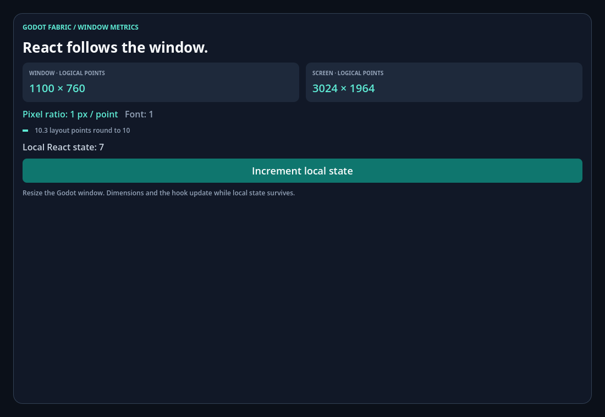

# Window metrics through original React Native modules

```sh
npm run example -- metrics
npm run example -- metrics --headless
npm run example -- metrics --capture
```

[App.jsx](App.jsx) imports public `AppRegistry`, `Dimensions`, `PixelRatio`,
`useWindowDimensions`, `View`, `Text` and `Button`. `MetricsPanel` is a registered
React root mounted by the `Panel` FabricSurface in [scene.tscn](scene.tscn).
Its single FabricApplication owns Hermes, native modules and window metrics.

The panel shows the application window and current screen in logical content
points, plus the content pixel ratio and text multiplier. The button changes
local React state; resizing the Godot window updates the hook without resetting
that state. `Dimensions` and `PixelRatio` use the original RN implementations:
the native `DeviceInfo` module supplies initial constants and
`didUpdateDimensions` supplies later changes through RN's original event emitter.

[validation.gd](validation.gd) checks that the public window values match
`Window.get_visible_rect().size` and that the public screen values match
`DisplayServer.screen_get_size()` for the current screen divided by the content
density. It exercises callback and hook updates, local state retention, stable
snapshots for equal values, unknown event rejection and idempotent unsubscribe.
After removing every React root and public listener, it resizes the window and
reads fresh `Dimensions`; a remounted hook must observe that new state.

The scaling case uses uniform `CONTENT_SCALE_MODE_CANVAS_ITEMS` with
`content_scale_factor = 2`. Logical content dimensions halve relative to window
pixels, original `PixelRatio.get()` becomes 2 and RN's pixel conversion/rounding
follow that density. A 10.3-point native View also changes from 10 to 10.5 points,
checking that Fabric's real `pointScaleFactor` follows the content density.
The validation restores the original Godot settings and
checks shutdown of subscriptions, roots, native modules and scheduling resources.
The entry's `GodotMetricsSubscriptionCount` is internal validation instrumentation;
the React example does not import a platform-specific subscription API.

Every bounded run writes `build/report.json`, with per-stage React/native/Godot
observations and individual pass/fail checks. `--capture` additionally writes
`build/metrics-initial.png`, `build/metrics-resized.png` and
`build/metrics-scaled.png` using actual Godot Viewport readback. Headless runs
validate contracts; screenshots require a graphical renderer. No screenshot or
test count is claimed before running the case.

The [native evidence](../../docs/evidence/native-foundation/README.md) records
64 headless and 67 graphical assertions for this checkpoint.




This is a content-coordinate contract, not OS density or mobile parity.
`fontScale = 1` reflects the currently implemented text multiplier; OS text-size
preferences still need an adapter. Safe-area and system-bar insets, OS DPI policy,
iOS/Android reference comparison, viewport render-target stretch, embedded
windows and multiple native windows remain gaps. A headless DisplayServer may
report no physical screen; the example compares its actual reported values rather
than inventing a monitor size. Unsupported coordinate modes must fail visibly.
