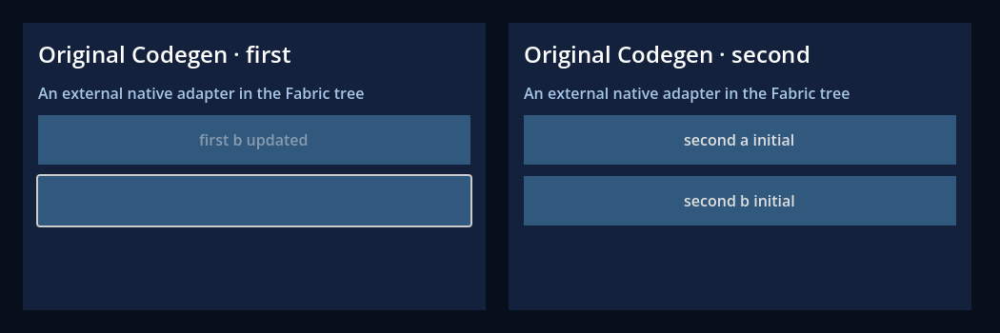

# Original Codegen native extension

This independent consumer selects an installed native package without editing the
renderer core. Its two React roots render `ExternalBadge` as real Godot Buttons.
The original RN Codegen supplies descriptors, Props, events, Commands and the
`ExternalProbe` CxxSpec. The package imports one shared Godot Fabric native host.

```sh
npm run test:adapters:loader -- --sdk build/native-sdk --out build/adapter-loader
npm run test:adapters:runtime -- --sdk build/native-sdk --out build/adapter-runtime --capture
```

Use a freshly built/verified macOS arm64 Release SDK and new output directories.
The runtime command provisions an independent addon/project, compiles the fixture
package and uses the addon's private tools for the JSX bundle. It exercises
35 headless checks, then 37 graphical checks including two captures. The generated
project can be opened in Godot from `build/adapter-runtime/project/project.godot`.
The package is a test fixture, not a published npm library or a new core primitive.


Keys `a` and `b` retain native identity when React reorders them. Props update on
the existing Control, removing props restores generated defaults, and retained
transports resolve the latest emitter. The updated first root has a reordered
Button with removed/default props and a disabled updated Button; the second root
keeps its initial props.



Original module calls cover sync results, Promise resolution and one emitter
subscription. Removal, unmount, remount and stop verify disposal and stale-command,
stale-callback and extracted-method behavior. Native events in this fixture use
Godot's Button signal; the captures prove rendering, not hardware input/IME.

[Source package](../../tests/adapters/package) ·
[Consumer JSX](../../tests/adapters/consumer/ui/index.tsx) ·
[Validation](../../tests/adapters/consumer/validation.gd) ·
[Executed evidence and gaps](../../docs/evidence/native-adapters/README.md)
