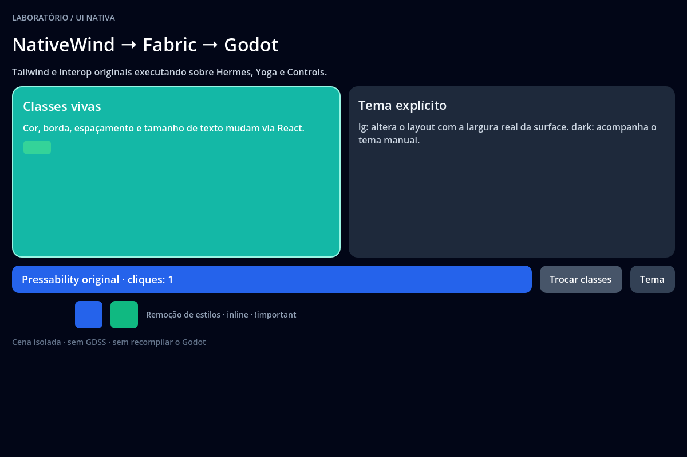

# NativeWind classes and themes

[Application](App.jsx) · [Godot scene](scene.tscn) · [Examples index](../README.md)

Increment state, change class-driven styles and toggle the manual color
theme. The automated check also clears overrides. Resize across the breakpoint and observe variables.

## Run

From the repository root after `npm run setup`:

```sh
npm run example -- nativewind
npm run example -- nativewind --headless
npm run example -- nativewind --capture
```

The first command opens the UI; the others validate and exit. Edit `App.jsx`,
close the window and rerun to rebuild. Reports use `build/report.json`.
Captures use `build/nativewind-*.png` (renderer readbacks). Retained public results
are in [evidence](../../docs/evidence/README.md).

## Contract and validation

UI imports public `react-native` primitives. Diagnostic exports use local
helpers. NativeWind 4.2.7/css-interop 0.2.7 run with Tailwind 3.4.17. Unsupported
utilities/modules fail visibly; system appearance is not integrated.

Compiler provenance, cascade/inline precedence, variables, dark mode, responsive
layout, Pressability and unsupported-contract error boundaries.
The native checks additionally require the acceptance marker and reject script
errors, runtime errors, crashes and timeouts. Generated reports are local and
are overwritten by another individual check.

## Renderer captures

These are Godot Viewport readbacks from the [current validation record](../../docs/evidence/public-controls/README.md).



