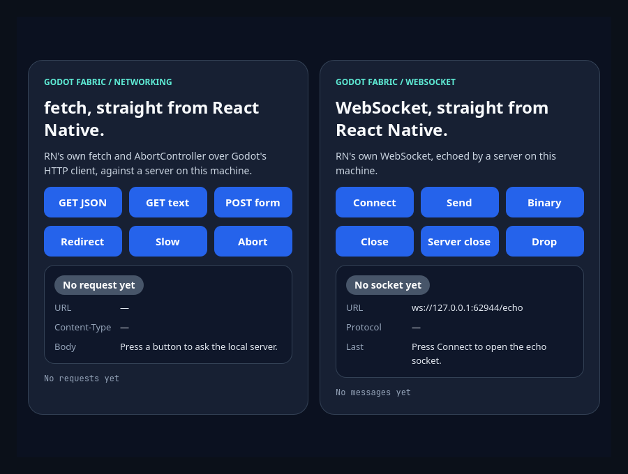
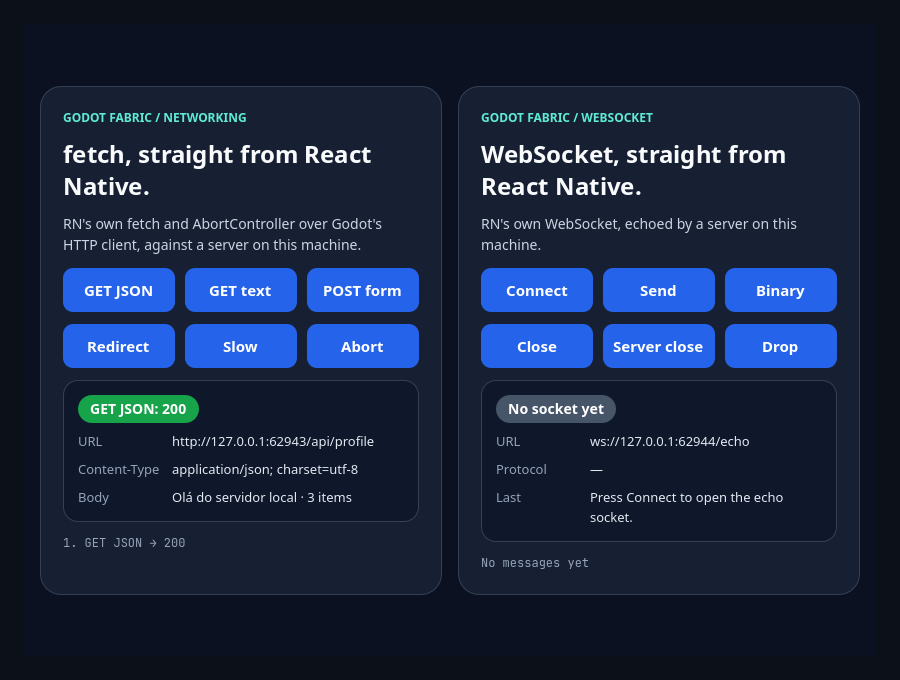
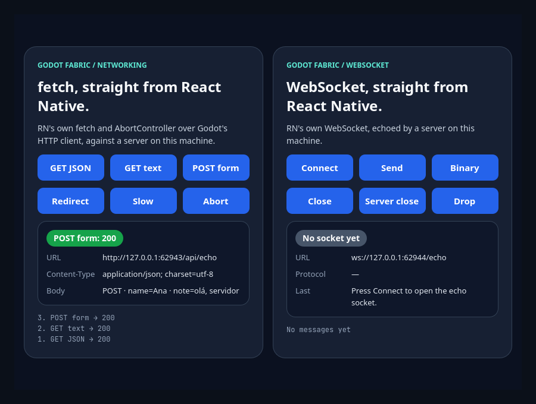
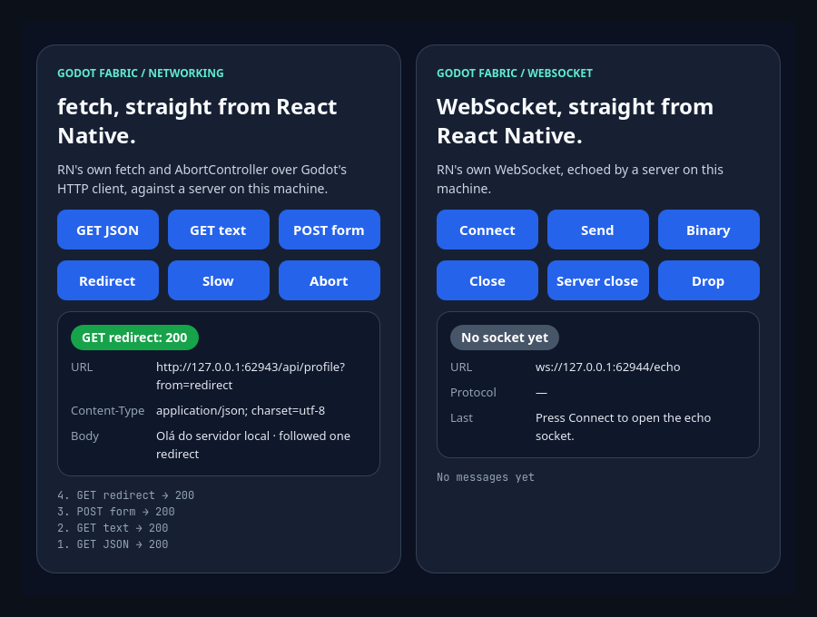
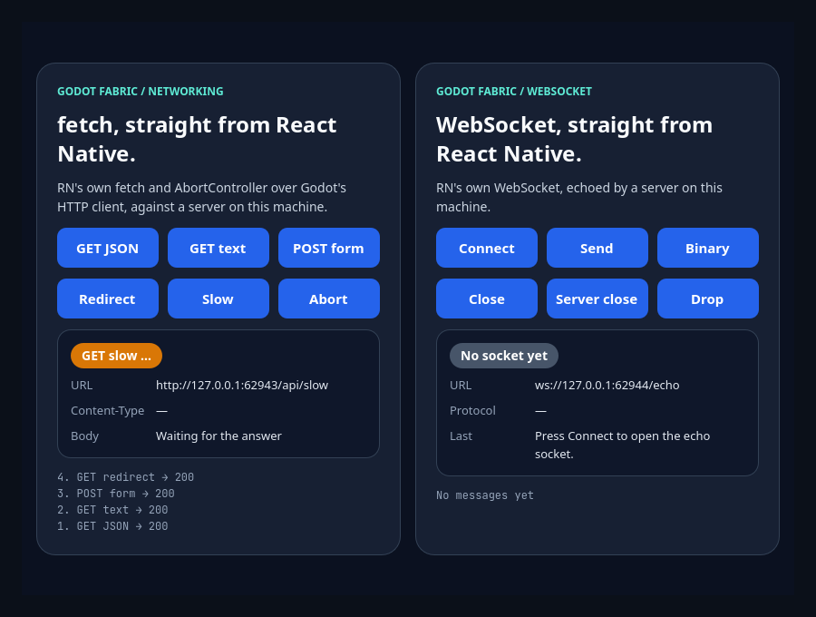
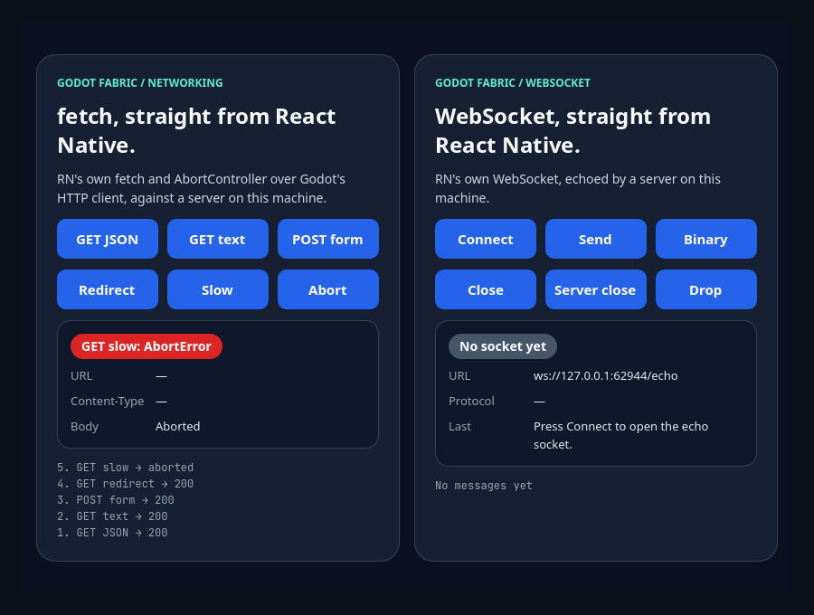
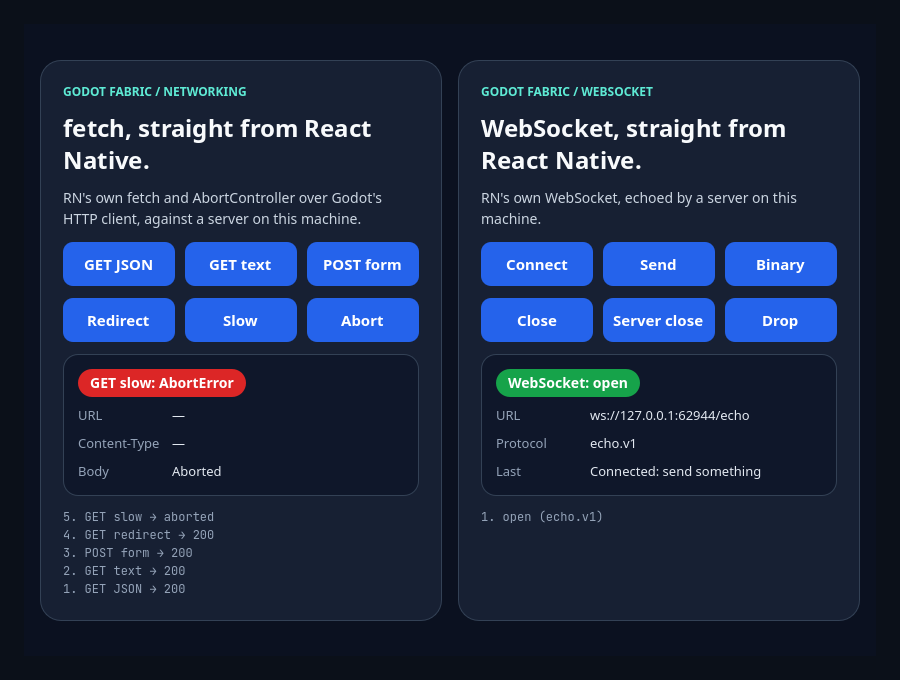
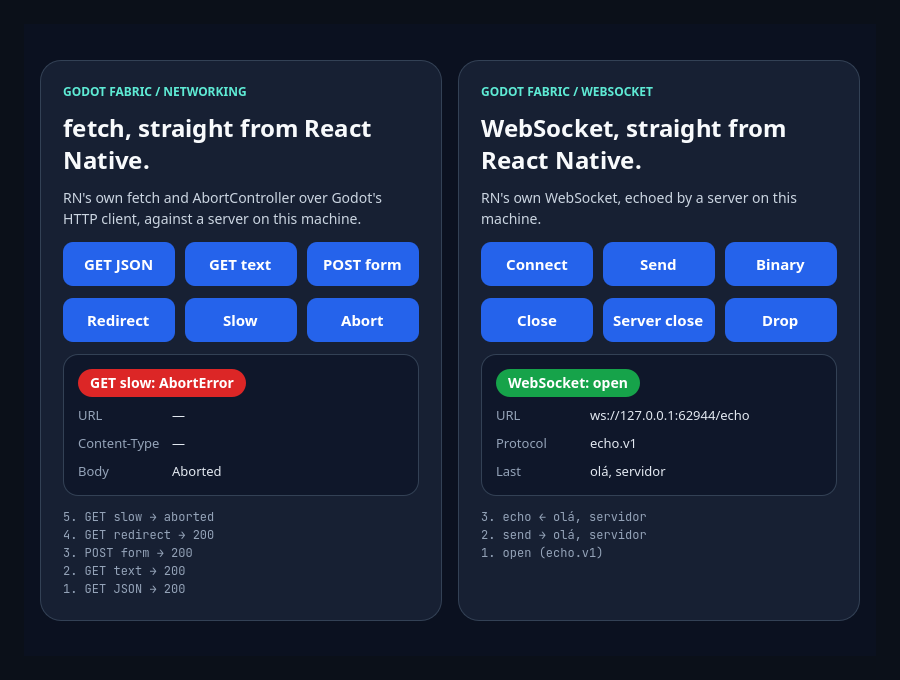
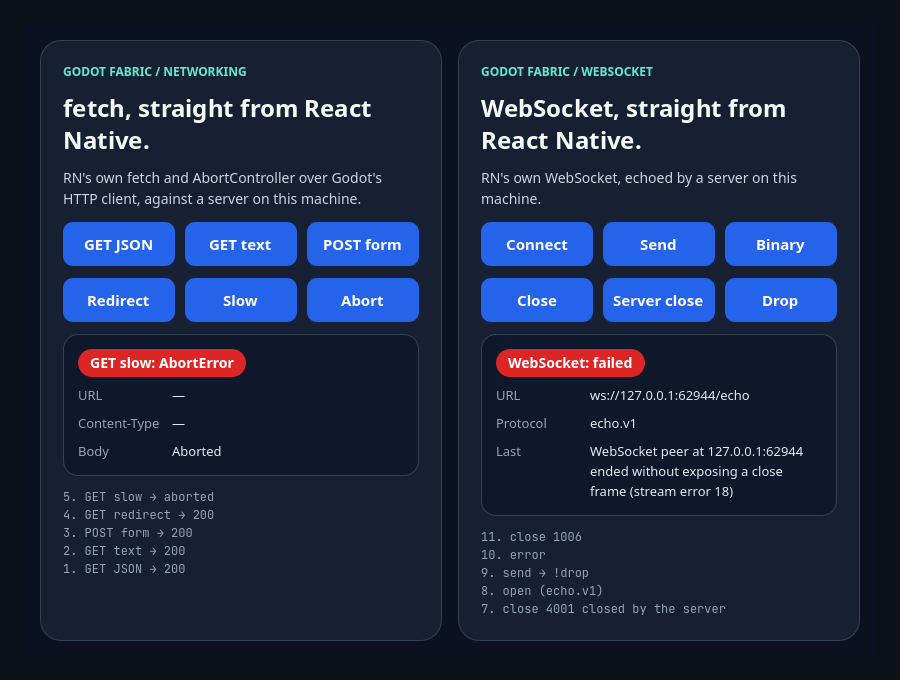
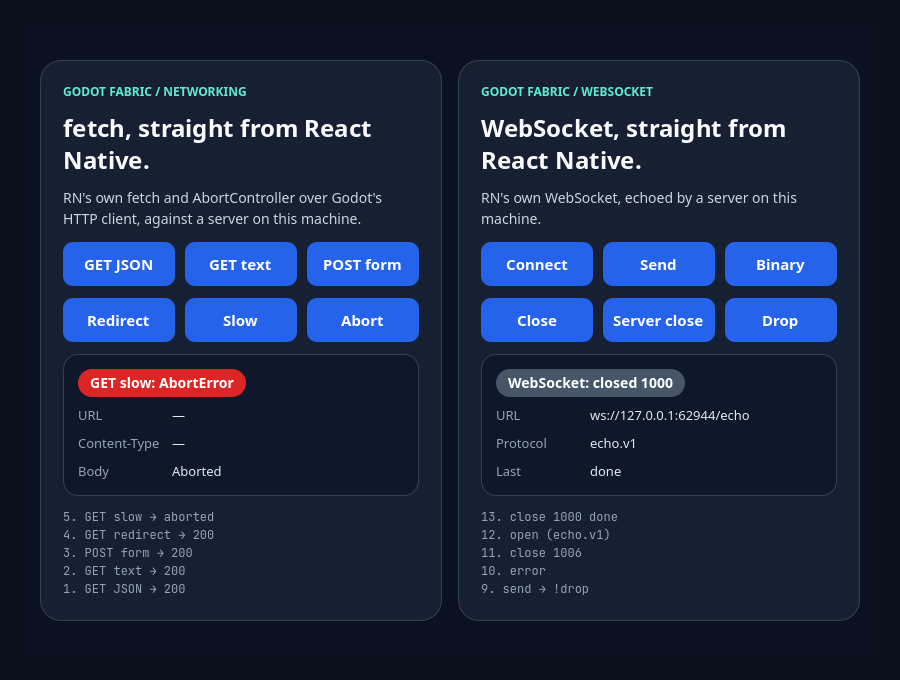

# fetch and WebSocket over Godot's networking

```sh
npm run example -- networking
npm run example -- networking --headless
npm run example -- networking --capture
npm run test:networking
npm run test:websocket
```

React Native's original `fetch` (with `Headers`, `Request` and `Response`),
`XMLHttpRequest`, `FormData`, `Blob`, `FileReader`, `AbortController` and `WebSocket` run in
the application: RN's own JavaScript, installed from the host's initialization exactly as
`InitializeCore` installs it, over four native modules the host implements with RN's Android
contract (`Networking`, `BlobModule`, `FileReaderModule` and `WebSocketModule`), an HTTP
transport on Godot's `HTTPClient` and a WebSocket transport that keeps Godot's `HTTPClient`
as its asynchronous DNS/TCP/TLS connector, then uses its public stream with pinned wslay for
RFC 6455 framing. The launcher entry is the
interactive demo, a screen with two cards. The left one has six buttons (GET JSON, GET text,
POST form, Redirect, Slow and Abort) that call `fetch` against a small HTTP server the scene
starts on loopback, with a status badge, the final URL, the content type, the body and a log
of the operations. The right one has six buttons (Connect, Send, Binary, Close, Server close
and Drop) that drive a `WebSocket` against an echo server the scene starts on loopback, with a
status badge, the URL, the subprotocol the server chose, the last message and a log of the
socket's events. Nothing reaches the network.

`npm run test:networking` and `npm run test:websocket` are the evidence suites, outside the
catalog: RN's APIs against deterministic Node servers over HTTP, HTTPS, ws and wss, in two
roots of one application, with the preceding host as the control and retained sabotages. The
[networking record](../../docs/evidence/networking/README.md) is the first, and the
[WebSocket record](../../docs/evidence/websocket/README.md) the second and the owner of the
captures below.

## Use the example

The scene starts two servers on ephemeral loopback ports and passes their addresses to the
root as `baseUrl` and `socketUrl`. Click a button, read the badge, and click Slow, then Abort,
to end a request the server never answers; click Connect, then Send, to see a message
come back. The ports in the URL lines change on every run. The captures show both cards
side by side; the card you did not touch keeps what it last showed.

### The fetch card



**Idle** is the screen before any request or socket: a gray badge reading `No request yet`,
dashes for the URL and the Content-Type, and an empty log; the WebSocket card reads
`No socket yet`.



**GET JSON** calls `fetch` on `/api/profile` and reads `response.json()`: a green badge
`GET JSON: 200`, the response URL, `application/json; charset=utf-8` and the message
of the body. The server received exactly one GET.



**POST form** sends a `FormData` with two string parts, `name` and `note`, as
`multipart/form-data`. The server parses the parts and echoes them, so the body line
reads `POST · name=Ana · note=olá, servidor`, accents included.



**Redirect** requests a path the server answers with a 302. The host follows it
itself, the badge shows `200` and the URL line the final address,
`/api/profile?from=redirect`; the server saw two requests.



**Slow** stays in flight: the badge turns amber, the body reads `Waiting for the
answer`, and the application's networking module counts one request in flight while
the server holds it.



**Abort** ends it through an `AbortController`: a red badge reading `GET slow:
AbortError`, the body `Aborted`, the connection closed at the server, and nothing in
flight in the module.

### The WebSocket card



**Connect** opens `ws://127.0.0.1:<port>/echo` offering two subprotocols, `echo.v2` and
`echo.v1`. The server speaks `echo.v1`, so the badge turns green (`WebSocket: open`), the
protocol line reads `echo.v1` and the log starts with `open (echo.v1)`. The server accepted
one socket and the module counts it open. The left card still shows the last request of
the fetch run.



**Send** sends the text `olá, servidor`; the server echoes it in the mode it came in, so the
last line reads `olá, servidor`, accents included, and the log shows `send →` and `echo ←`.
**Binary** sends four bytes (`1 2 3 250`) as a `Uint8Array`: the server receives one binary
message and the same four bytes come back as an `ArrayBuffer` (the log reads `echo ← 4 bytes:
1 2 3 250`).


**Server close** sends the text `!close`, which the server answers by closing with code 4001
and the reason `closed by the server`. The badge goes gray (`WebSocket: closed 4001`), the last
line is the reason, the log ends with `close 4001 closed by the server`, and the server saw the
closing handshake finish.



**Drop** needs a new socket (Connect again) and sends `!drop`: the server cuts the TCP
connection without a close frame. RN gets an `error` and a `close` with code 1006, the badge
turns red (`WebSocket: failed`), and the last line is the host's message,
`WebSocket connection to 127.0.0.1:<port> was lost without a close frame`.



**Close** needs another socket and ends it from the page with `close(1000, "done")`: the server
echoes the close frame, the badge goes gray (`WebSocket: closed 1000`), the last line reads
`done`, and the server received that code and reason. Three sockets were opened in all, two
ended in a close and one in a failure.

## What the validation establishes

[validation.gd](validation.gd) sends actual Godot mouse input and reads the labels
and the badge colors the host drew, what React observed, what each server received and the
application's networking module. The fetch card: GET JSON shows the status 200,
the final URL, `application/json; charset=utf-8` and the parsed body, and the
server received exactly one GET. GET text decodes a UTF-8 body with accents. POST
form sends `FormData` as multipart: the server finds both parts. Redirect shows
that the host follows the 302 itself and reports the final URL, with two requests
at the server. Slow stays in flight, the badge turns amber and the module counts
one request in flight; Abort ends it with an `AbortError`, the server sees the
connection closed and nothing stays in flight. The WebSocket card: before any click the
server has seen nothing and the module no connect; Connect opens one socket and the server
chose `echo.v1`; Send and Binary are received by the server as one text and one binary
message and come back; Server close arrives with 4001 and its reason and the server saw the
handshake finish; Drop ends in `error` and `close 1006` and the module counts one failed
socket; Close is received by the server as 1000 and `done`; in all three sockets were
opened and none is left open, and stopping the application releases the module and both
transports without a host error. With `--capture` the renderer's frames are saved and the
badges' colors sampled in them.

## Original syntax

```jsx
const controller = new AbortController();
const response = await fetch(`${baseUrl}/api/profile`, {signal: controller.signal});
const data = await response.json();

const form = new FormData();
form.append("name", "Ana");
await fetch(`${baseUrl}/api/echo`, {method: "POST", body: form});

const request = new XMLHttpRequest();
request.onload = () => console.log(request.status, request.responseText);
request.open("GET", `${baseUrl}/api/text`);
request.send();

const socket = new WebSocket(socketUrl, ["echo.v2", "echo.v1"]);
socket.binaryType = "arraybuffer";
socket.onopen = () => socket.send("olá, servidor");
socket.onmessage = (event) => console.log(event.data);
socket.onclose = (event) => console.log(event.code, event.reason);
```

## Limits

Cookies are neither stored nor sent, responses are not decompressed (a compressed
answer fails explicitly), requests use HTTP/1.1 on one connection each, upload and
download progress events are not sent, and `FormData` file parts and `uri` bodies
fail explicitly. WebSocket negotiates no extensions (no `permessage-deflate`), sends no
cookies and uses a 30-second host deadline for connect plus upgrade. Stopping the
application attempts a nonblocking 1001 close; pending input can make the peer report a
TCP drop instead of a completed close handshake. The byte and event budgets, data-before-close,
fragmented ping, TLS close/drop cases and cancellation behavior are covered by the
[WebSocket evidence](../../docs/evidence/websocket/README.md). See the
[networking research](../../docs/research/networking.md), the
[WebSocket research](../../docs/research/websocket.md) and the
[networking](../../docs/evidence/networking/README.md) and
[WebSocket](../../docs/evidence/websocket/README.md) evidence.
