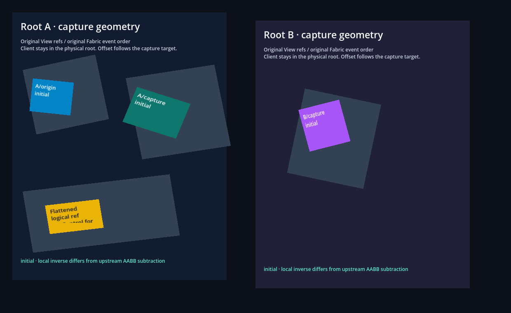
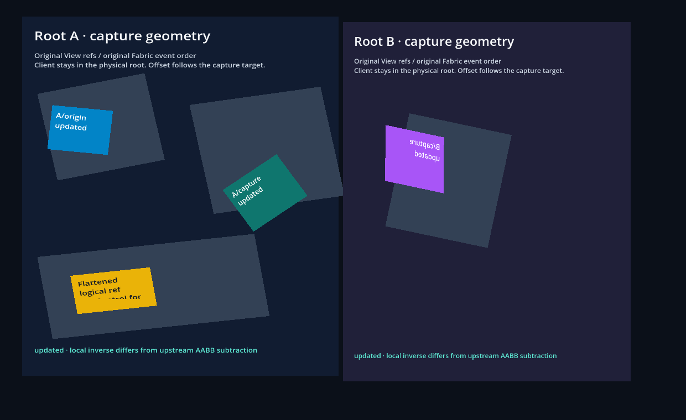

# Pointer capture in transformed and embedded roots

```sh
npm run example -- pointer-geometry
npm run example -- pointer-geometry --headless
npm run example -- pointer-geometry --check --capture
```

This isolated example uses original React Native `View` refs, JSX pointer
handlers and Fabric capture negotiation. Two AppRegistry roots share one
Hermes application. The blue physical origin captures a contact, transfers
it to a transformed green sibling and then to a purple target in the other
root. Native input also reaches capture when it has no physical hit.

`clientX/clientY` and their `x/y/pageX/pageY` aliases stay in the contact's
physical origin root. `screenX/screenY` describe the same native sample in
current window units. `offsetX/offsetY` describe the actual dispatched target's
local space, using the inverse of its complete affine and Godot embedding.
Got/lost notifications use their own old/new target geometry at the same sample.

The gallery includes ordered nonuniform scale and rotation, skew, percentage
transform origin and a reflected affine matrix. A real captured move callback
updates a React transform without replacing the ref or contact. Godot moves
and scales roots while capture stays active. The first raw-window move after
changing density to two is dispatched before a frame or JS metrics refresh.

The yellow child belongs to a transparent, genuinely flattened logical View
under a transformed materialized ancestor. Its original public ref can own
capture even though the wrapper has no Godot Control. Ancestor JSX handlers
observe its events. Capture uses the logical ShadowNode path rather than
assuming every public ref has a concrete native view.

Validation compares native affines/corners, original public measurements and
every recorded pointer event with independent values declared in
[validation.gd](validation.gd). Measurements retain RN's ancestor-by-ancestor
AABB behavior; target-local offsets and exact painted corners have separate
oracles. Legacy TouchEvent payloads retain the physical origin during pointer
capture. Retiring the capture root disconnects its ref while the originating
contact and a concurrent capture in the surviving root continue. Up/cancel
and shutdown must release native tags, contact routing and all original
processor registries.

## Upstream boundary and proof

The pinned RN 0.87.1 retargeter explicitly uses an incomplete implementation:
it subtracts the target's transformed AABB origin from the incoming client
point. That does not invert rotation/skew and does not account for a capture
target embedded in another Godot root. The report records this original
algorithm as a **separate counterfactual**, alongside the corrected target-local
golden. Correct local geometry is an explicit Godot adapter behavior change;
it is not a claim that these offsets are identical to the incomplete upstream
result. Capture IDs, pending/active ownership and event ordering retain the
original processor contract.

The unchanged final fixture fails **55/631 checks** on the preceding host and
passes **631 headless / 648 native checks** on the corrected implementation.
There are 14 independently selected pixel checks and three actual Viewport
captures. [The evidence receipt](../../docs/evidence/pointer-geometry/README.md)
records source/binary hashes, separate modes, the original RN witness and
remaining acceptance.

A genuine singular source embedding uses `FabricSurface.offset_transform_scale`,
which preserves zero. Cancel/Lost keep every coordinate exactly from the last
valid event on the same capture target; original TouchCancel retires only that
contact. A concurrent capture in the other root continues. Restoring the
embedding and sending a late Up cannot revive the canceled contact.

A React `display:none` case retains a connected captured ref and original event
ordering. The unpainted target has no inverse: its pinned EmptyLayoutMetrics
origin is zero, so captured offsets explicitly remain equal to owner-root
client coordinates. Showing the target cannot resurrect an ended pointer.

## Captures



The green target combines ordered nonuniform scale/rotation; the purple target
uses skew and a percentage origin. The yellow painted child belongs to the
flattened logical capture ref, which has no native wrapper Control.


The captured Move callback changes React state and commits the green transform.
The reflected purple target keeps its original ref. A pixel check verifies
that the old green location is repainted after the update.



Godot moves/scales roots and changes content density. The first raw-window move
at density two is checked before a frame or cached JS metrics refresh.

## Limits

The inputs are injected desktop samples in two roots of one native window.
Ordinary input flushes the beat/work queue per accepted sample; omitting frames
alone does not exercise original EventQueue unique-event coalescing. The
portable history witness verifies reordered serial semantics separately.

Physical hardware, scrolling, multiple windows, cross-application stacking,
complete responder/PanResponder and mobile capture are not certified. The
existing original RN iOS/Android core fixture has no captured-pointer oracle.
Complete HostInstance, imperative EventTarget and GF-08/GF-13 acceptance remain
in the [roadmap](../../ROADMAP.md). No full RN numerical-parity claim follows
from correcting the explicitly incomplete pinned algorithm.
