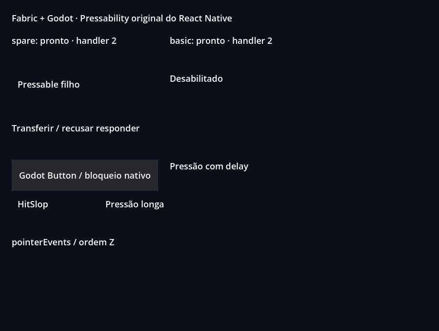
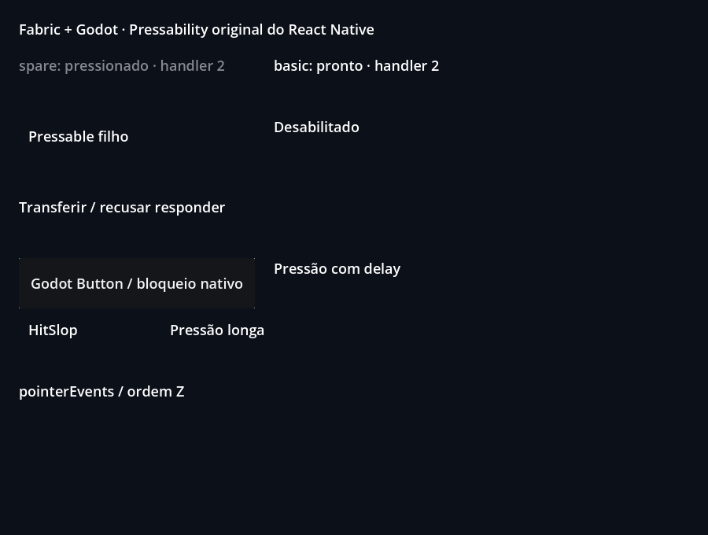

# Pressability and responder negotiation

[Application](App.jsx) · [Godot scene](scene.tscn) · [Examples index](../README.md)

Press, hold, drag out/back, use nested targets and try the disabled target.
The native fixture also covers retention, hit slop and responder transfers.

## Run

From the repository root after `npm run setup`:

```sh
npm run example -- pressable
npm run example -- pressable --headless
npm run example -- pressable --capture
```

The first command opens the UI; the others validate and exit. Edit `App.jsx`,
close the window and rerun to rebuild. Reports use `build/report.json`.
Captures use `build/pressable.png`, `pressable-pressed.png` (renderer readbacks). Retained public results
are in [evidence](../../docs/evidence/README.md).

## Contract and validation

Internal wrappers use the original RN Pressability implementation. Full
physical-device gestures, hover and keyboard accessibility remain separate gaps.

Logical Viewport pointer/device 1001: normal/long/delayed press, touch propagation,
cancel, nested negotiation, keyed reorder and stop during a held gesture.
The native checks additionally require the acceptance marker and reject script
errors, runtime errors, crashes and timeouts. Generated reports are local and
are overwritten by another individual check.

The two-contact case starts both contacts inside the same Pressable. Its first
contact ending must preserve the responder and pressed render state without
`onPress` or `onPressOut`. A subsequent drag of the remaining contact verifies
its unchanged identifier and the one-contact native payload. The last contact
ending must release the responder and produce exactly one callback each for
`onPressIn`, `onPress` and `onPressOut`, with no remaining touches in the
final press payload. Upstream Pressability triggers `onPress` from responder
release; the renderer must retain that owner while a descendant contact remains.

## Renderer captures

These are Godot Viewport readbacks from the [current validation record](../../docs/evidence/public-controls/README.md).




