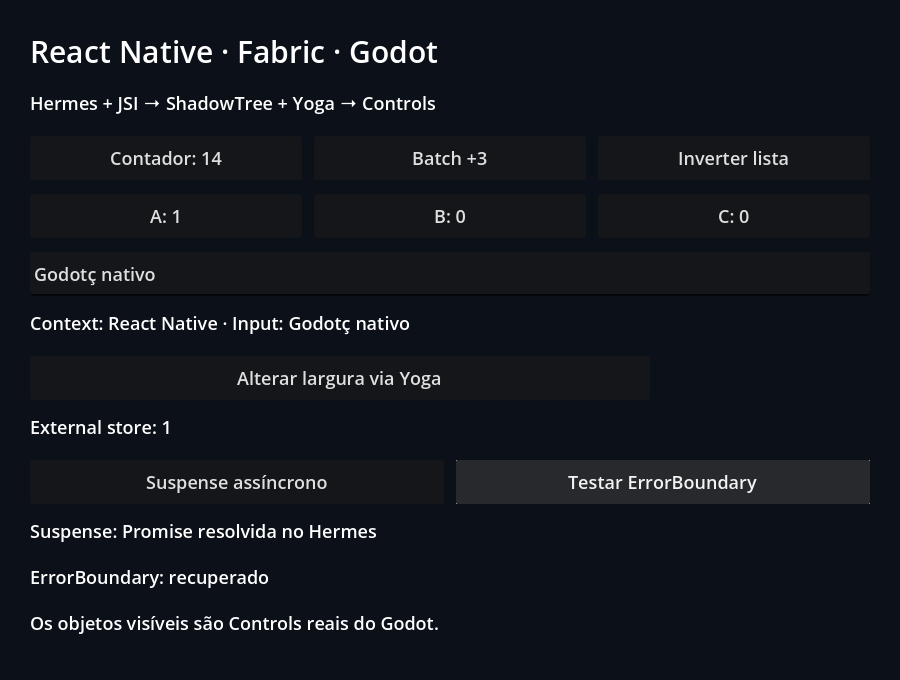

# React state and lifecycle

[Application](App.jsx) · [Godot scene](scene.tscn) · [Examples index](../README.md)

Use the controls to increment state, reorder keyed children, show/hide content,
load a Suspense resource and exercise an error boundary. Context, memoization
and an external store are part of the fixture.

## Run

From the repository root after `npm run setup`:

```sh
npm run example -- react
npm run example -- react --headless
npm run example -- react --capture
```

The first command opens the UI; the others validate and exit. Edit `App.jsx`,
close the window and rerun to rebuild. Reports use `build/report.json`.
Captures use `build/native.png` (renderer readbacks). Retained public results
are in [evidence](../../docs/evidence/README.md).

## Contract and validation

Internal wrappers in `src/components.jsx`; the original React/Fabric renderer
still owns reconciliation. This is a semantic validation fixture, not the
public SDK entry point.

36 assertions in each display lane in the retained release baseline.
The native checks additionally require the acceptance marker and reject script
errors, runtime errors, crashes and timeouts. Generated reports are local and
are overwritten by another individual check.

## Renderer captures

These are Godot Viewport readbacks from the [current validation record](../../docs/evidence/public-controls/README.md).


