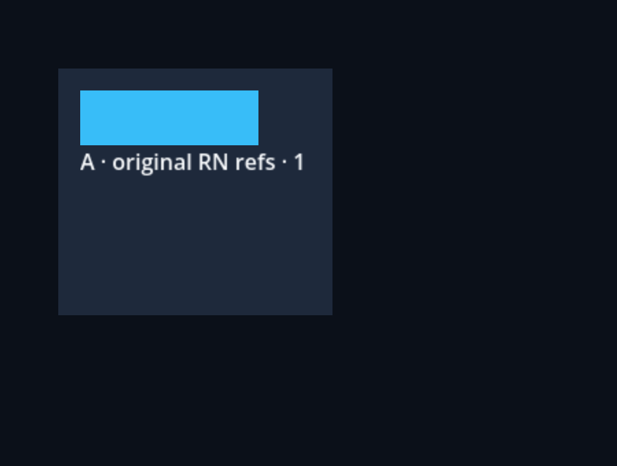

# Original React Native refs inside Godot

This example mounts the same public React component in two `FabricSurface`
Controls owned by one `FabricApplication`. Surface A is scaled; surface B is
rotated. The ref is the pinned RN `ReactNativeElement`, with its original
`ReactNativeDocument`, node traversal and Codegen-backed `NativeDOMCxx` module.

```sh
npm run example -- refs
npm run example -- refs --headless
npm run example -- refs --capture
```

The validation compares `measureInWindow` and `getBoundingClientRect()` with
all four corners of the actual Godot Control, and verifies that `measure`,
`measureLayout` and offset sizes retain RN root/layout semantics. Moving the
Godot surface updates window coordinates without moving its React children.
Numeric `UIManager` measurements and `findNodeHandle` use the same native tree.


It also checks parent/child/document relationships, cross-root layout failure,
`setNativeProps` updates through original Fabric commits, unrelated rerenders,
declarative overrides, keyed replacement, retained stale refs and root unmount.
The test report records actual Hermes/native results; source code alone is not
an acceptance result.



The [checkpoint evidence](../../docs/evidence/native-foundation/README.md)
records the runtime and executed checks. The blue child's width changes through
the original Fabric commit path; A keeps its state when B is unmounted.

This is a GF-08 checkpoint. RN style transforms/origin, pointer capture/input,
inline-text geometry, high-DPI/multi-window metrics and the complete UIManager
surface still need their roadmap acceptance. Godot embedding transforms in
this example are already independent of those remaining RN style transforms.
