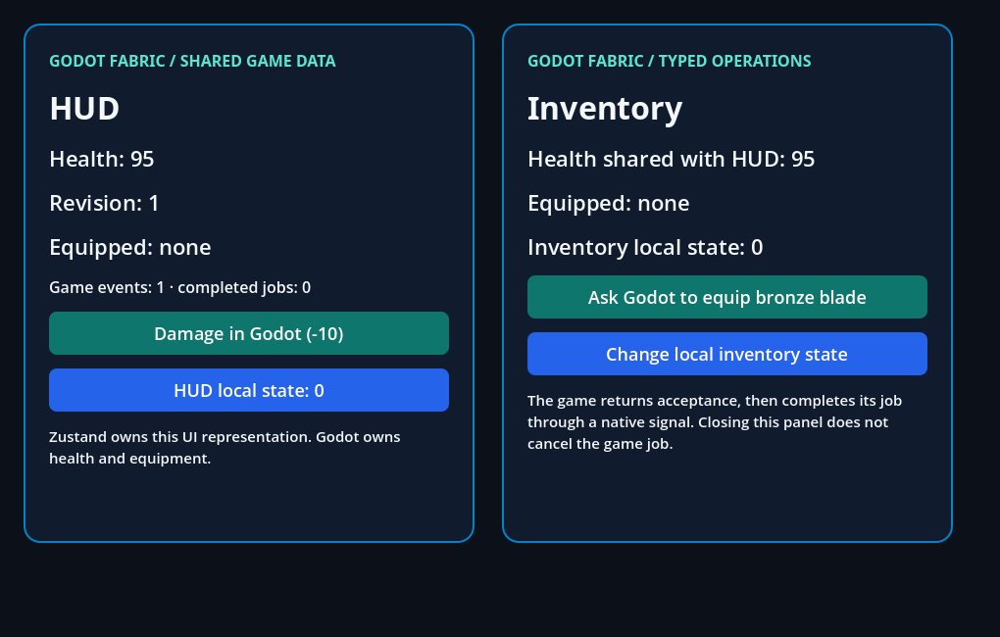

# Game services and shared React state

```sh
npm run example -- services --headless
npm run example -- services --capture
```

[game.gd](game.gd) owns health, equipment and asynchronous equip jobs. Before
the surfaces mount, it registers typed signals, state getters and methods through
the experimental `GodotFabric.for_application(application)` GDScript scope.
The laboratory preloads the SDK script because SDK sources are behind `.gdignore`;
installed addons expose its global `GodotFabric` class.

[App.jsx](App.jsx) imports `GodotFabric` from `@godot-fabric/runtime` and public
React Native components. `GodotFabric.connect` establishes an initial state
snapshot and its subsequent revisions. `subscribe` receives each occurrence of
a signal, with its declared arguments. `call` invokes a registered method and
returns its result and declared response kind. Every subscription has `ready`
and an idempotent `remove()` operation. These signatures are an experimental
implementation of the approved service direction; they do not settle remaining
Architecture 2.0 decisions.

Zustand 5.0.15 stores the React representation shared by HUD and inventory. Game
rules and accepted jobs remain in GDScript. A getter deliberately changes health
during the first read: the native connection must retry and deliver a consistent
snapshot, while the already-installed damage subscription preserves the event.
Integer schemas reject fractional damage before invoking game code.

Equipping returns an **acceptance** and job identifier. The game timer later
updates equipment and emits completion. Closing the inventory unmounts its React
root while that accepted job continues; the surviving HUD receives the result.
Remounting inventory observes current equipment and resets its local React state.
Cancelling is an explicit game method, independent of UI teardown.

[validation.gd](validation.gd) compares actual native Text with the shared store,
checks initial-read races, ordered signals, typed errors, completion versus
acceptance, independent root lifetime, cancellation and shutdown. It publishes
`build/report.json`. Graphical validation additionally saves
`build/services-initial.png`, `services-completed.png` and
`services-remounted.png` through Godot Viewport readback.



The first getter changes health from 100 to 95 during connection. Both roots
show the consistent revision rather than a value from before the change.


Inventory has unmounted while its accepted equip job completes. HUD alone
shows `bronze-blade`, revision 4 and one completed job. Simulation pause is
checked before completion; UI timers remain active during that pause.


Remount restores current game data while resetting inventory's local React
state. The [retained evidence](../../docs/evidence/game-services/README.md)
records 36 headless and 39 graphical assertions, plus dedicated service
boundary and application-destruction fixtures.

This example does not establish React Native platform parity. General component
codegen, cross-thread execution, mobile lifecycle and exported consumer service
coverage remain roadmap work. Bindings must exist before a connection or call is
requested; a missing binding fails instead of attaching later to another source.
