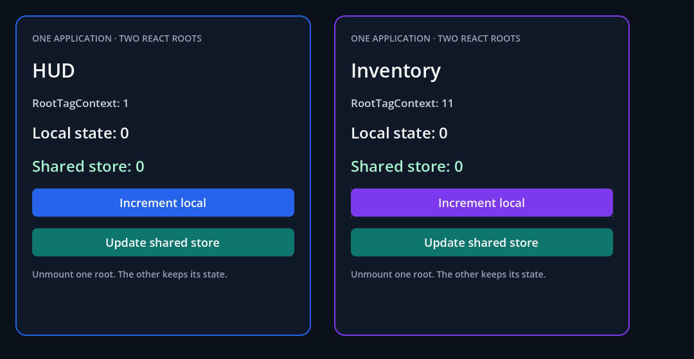

# Shared application and registered roots

```sh
npm run example -- shared
npm run example -- shared --headless
npm run example -- shared --capture
npm run test:application
```

[App.jsx](App.jsx) uses public `AppRegistry`, `RootTagContext`, `View`, `Text`
and `Button`. Only HUD and Inventory are registered; their child components
are ordinary React components. The original RN AppRegistry calls the original
Fabric renderer through Godot's platform container.

The [scene](scene.tscn) shows where JSX enters the Godot tree:

```text
SharedRootsExample
├── SharedApplication (FabricApplication: one Hermes + Fabric + timers)
├── HUD (FabricSurface → AppRegistry "HUD")
│   └── committed Godot Controls
└── Inventory (FabricSurface → AppRegistry "Inventory")
    └── committed Godot Controls
```

Each surface references `../SharedApplication`, declares `component_name` and
supplies `initial_props`. Its Control size supplies its Yoga constraints.
Buttons update each root's local `useState` or the explicit module store
consumed through `useSyncExternalStore` by both roots.

The bounded check updates HUD props while preserving state, resizes Inventory,
unmounts/remounts one tree, hides HUD, replaces a surface Node and removes all
roots before mounting again. Shared module state and application timers remain
alive; subscriptions and native tags belong to each mounted root. Finally
`SharedApplication.stop()` cleans up the remaining tree and scheduling queues.
The failure suite checks invalid owner/entry/bundle, duplicate keys, reserved
keys, unsupported sections and attempts to restart a stopped application.




The [validation record](../../docs/evidence/shared-roots/README.md) explains
the captures, transport, 35 headless/38 graphical checks, 19 negative checks,
8 legacy replacement/reentry checks, an accelerated-clock regression and
remaining gaps. These are real Godot Viewport readbacks of the generic example.

These are experimental native authoring properties. The approved resource-based
application/SDK/editor flow, `GodotFabric` service API, final execution/shutdown
policies, dev bootstrap, hidden Activity, portals, pause/resume and mobile/desktop
reference comparison remain roadmap work. `hide()` preserves effects; it is
not React Activity's hidden mode. This is currently macOS arm64 evidence.
