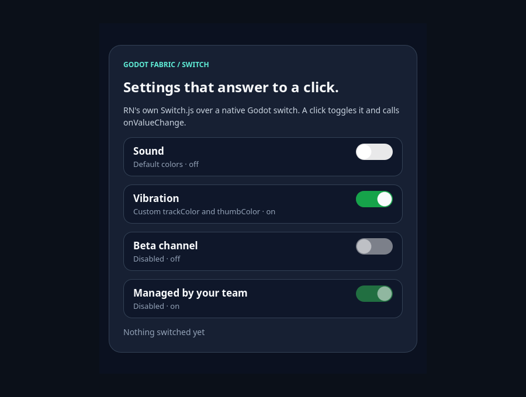

# Switch

```sh
npm run example -- switch
npm run example -- switch --headless
npm run example -- switch --capture
npm run test:switch
```

The public `Switch` renders React Native's original `Switch.js` over a native
Godot switch. Because Godot is not Android, Switch.js takes its iOS-family path:
the codegen-generated `RCTSwitch` ViewConfig, the bubbling `onChange` event
`{value, target}` and the `setValue` command. The host registers RN's shared
iOS/macOS Switch descriptor and draws the track and thumb in a Godot Control
that toggles on an actual mouse click or touch tap. The launcher entry is the
interactive demo: four controlled switches, one with the default colors, one
with its own `trackColor` and `thumbColor`, and two disabled. `npm run test:switch`
is the [evidence](../../docs/evidence/switch/README.md) suite, outside the catalog:
**108/108 headless checks** in two roots of one Hermes application. On the
preceding host, the same bundle fails exactly the **2 normative mount checks**; a
retained sabotage of the native `setValue` command fails 13 checks and the
independent oracle rejects it.

## Use the example



**Initial** is the screen as mounted. Sound is off and draws RN's iOS defaults (a
light track and a white thumb at the leading end); Vibration is on with its own
`trackColor.true` (green) and `thumbColor`; the two disabled switches (Beta
channel off, Managed by your team on) are drawn at half opacity. The status line
says `Nothing switched yet`, because React has heard no change.


**After the clicks** is the screen after real mouse clicks on Sound, on both
disabled switches and on Vibration. Each enabled click toggled its native switch
once and called `onValueChange` with the new value, React re-rendered the hint
under each title and the status line (`Vibration is off`), and the controlled
`value` followed without a `setValue` command. The clicks on the disabled switches
changed nothing and called nothing.

## What the validation establishes

[validation.gd](validation.gd) sends actual Godot mouse input and reads the
native Switch Controls the host drew. It checks that the example mounts four
switches as native switch Controls with RN's 63×28 frame in Yoga and on the
Control; that the values start as declared and only the last two are disabled;
that Sound draws the default off track and Vibration its `trackColor.true` and
`thumbColor`, a disabled switch is drawn at half opacity and an enabled one is
not, and the thumb sits at the leading end when off and at the trailing end when
on. A click on Sound toggles the native switch once with no `setValue` command,
`onValueChange` runs once with `true`, React re-renders the status text and the
switch is drawn on; clicks on the disabled switches neither press nor toggle
them and call nothing; a click on Vibration turns it off with its
`trackColor.false`. React rendered three times, once for the mount and once per
change, and stopping the application releases the root without a host error.
With `--capture` the pixels of each switch differ between the two captures for
the two that toggled and are identical for the two disabled ones. The headless run
passes 20 checks and the capture run 25.

## Evidence suite

```sh
npm run test:switch
```

With the preceding native host installed, the runner checks the control:

```sh
node tests/switch-native.test.mjs --allow-original-negative
```

## Original syntax

```jsx
import {useState} from 'react';
import {Switch, View} from 'react-native';

export function SoundSetting() {
  const [enabled, setEnabled] = useState(false);
  return (
    <View style={{padding: 16}}>
      <Switch
        value={enabled}
        onValueChange={setEnabled}
        trackColor={{false: '#767577', true: '#81b0ff'}}
        thumbColor={enabled ? '#f5dd4b' : '#f4f3f4'}
        ios_backgroundColor="#3e3e3e"
      />
    </View>
  );
}
```

`Switch` is controlled, as in RN: a tap toggles the native switch and calls
`onChange` and then `onValueChange`. If `value` does not follow, Switch.js sends
`setValue` and the native switch returns to `value`. `disabled` ignores input.
`trackColor` and `thumbColor` color the track and thumb; `ios_backgroundColor`
paints the view behind them with Switch.js's rounded corners. Without a style
size the switch measures 63×28, RN's frame on iOS 26.

## Limits

Keyboard activation and focus, accessibility, animation and thumb dragging, the
Android-only props and command, hardware and Godot mobile exports require
separate acceptance. After a Switch renders, `topChange` bubbles for every
component, so a `TextInput` change also reaches ancestors' `onChange`, as in RN.
See the [research](../../docs/research/switch.md).
