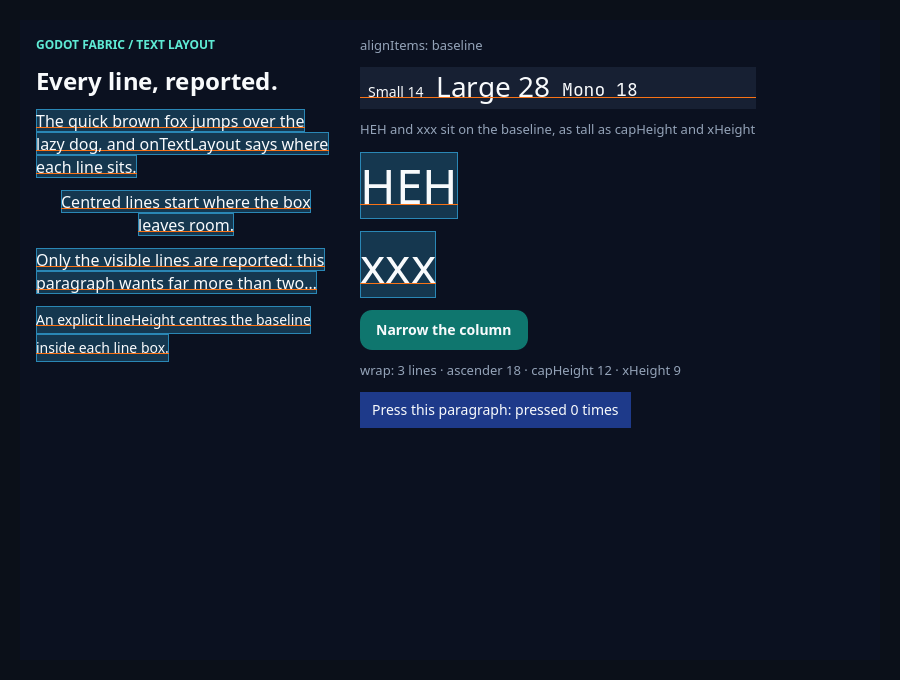
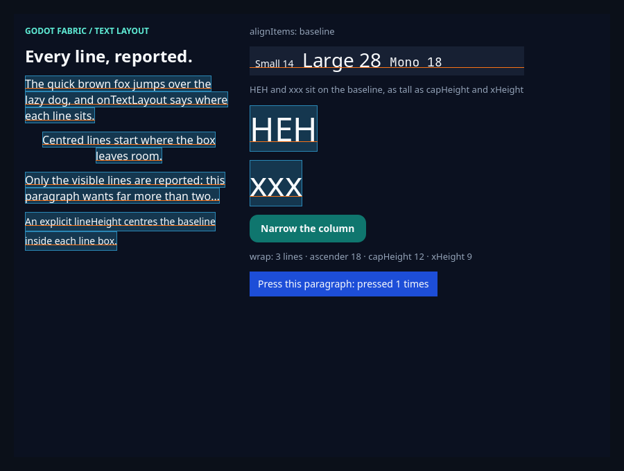
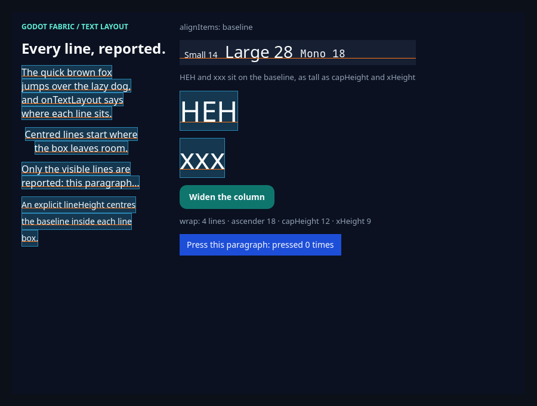

# Text layout

```sh
npm run example -- text-layout
npm run example -- text-layout --headless
npm run example -- text-layout --capture
npm run test:text-layout
npm run test:text-original
```

The public `Text` reports its lines through RN's own `onTextLayout`: after each
layout the event `{lines}` holds, for every visible line, `text`, `x`, `y`,
`width`, `height`, `ascender`, `descender`, `capHeight` and `xHeight`. The same
lines give Yoga the baseline of a `Text` in a row with `alignItems: 'baseline'`
(or `alignSelf: 'baseline'`). Both come from the shaped paragraph the host also
measures and paints, through a Godot platform `TextLayoutManager` that adds RN's
`measureLines` to the portable one. This example draws what the event says over
the paragraphs it came from: a translucent box at each line's `x`, `y`, `width`
and `height`, and an orange rule at its baseline, `y + ascender`.

## Use the example

- The left column has four paragraphs: a wrapped one, a centred one (the boxes
  start where the line does), one limited to two lines by `numberOfLines`
  (only the visible lines are reported) and one with an explicit `lineHeight` of
  28 (the baseline sits inside a taller box).
- The right column has a row of three texts of different sizes and fonts aligned
  by `alignItems: 'baseline'`, with one rule across the row at their shared
  baseline, then `HEH` and `xxx` at 48 px, where the rule and the box sit on the
  letters, and a button that narrows the column: the paragraphs wrap again, RN
  delivers new lines and the boxes follow. The summary line reads the first
  line's `ascender`, `capHeight` and `xHeight` from the event.
- The last line of the right column is a paragraph with `onPressIn`, `onPress` and
  `onPressOut`: `Text` renders RN's original `Text.js`, so a click on it reports
  press in, the press, and press out once Pressability's 130 ms minimum press duration
  has passed, and the count in the paragraph goes up.

## What the validation establishes

[validation.gd](validation.gd) sends an actual Godot mouse click and reads the
native Controls the host drew. The headless run passes 22 checks:

- Each `Text` is a native paragraph and received exactly one event for its first
  layout; the wrapped paragraph reports three lines, the limited one two and
  `HEH` one.
- The reported heights add up to the height Yoga gave each paragraph, and the
  host drew a box and a rule at every reported line, at the event's numbers, and
  none more.
- A centred paragraph's lines start at an `x` above zero and a left aligned one's
  at zero; an explicit `lineHeight` of 28 gives each line 28 pixels with the
  baseline inside the box.
- The three texts of the baseline row sit at different heights and share one
  baseline; the rule drawn from the first text's frame and ascender runs along it.
- A click on the button narrows the column: the wrapped paragraph reports more
  lines and receives a new event, `HEH`, whose lines did not change, receives
  none, the boxes follow and the heights still add up. The run raises no host
  error.
- A click on the pressable paragraph reports press in first and then the press
  once, and a press out (waited for by its event, not by a number of frames); React
  renders the paragraph again with the new count, and the run raises no host error.

With `--capture` the renderer's frame is read too and the run passes 36 checks:
every reported line has painted ink; the box drawn at each line's event frame
contains that line's ink, in both states; the ink of `HEH` ends on the baseline
`y + ascender` (±1 pixel) and is as tall as the reported `capHeight`, and the ink
of `xxx` is as tall as `xHeight`. The captures are saved as
`build/text-layout-initial.png` and `build/text-layout-narrow.png`. The
[evidence record](../../docs/evidence/text-original/README.md) keeps both frames, with the pressable
line, and their SHA-256; its [capture driver](../../docs/evidence/text-original/capture-press.gd.txt) clicks the
paragraph with real mouse input and saves it during the click and after it.


**Initial.** The wrapped paragraph has three lines, the centred one starts where its line
does, the one limited to two lines shows only those, and the `lineHeight` 28 boxes are taller
with the rule inside them. The row of three texts shares one baseline rule, and `HEH` and
`xxx` stand on theirs. The last line of the right column is the pressable paragraph, in its
resting blue, saying `pressed 0 times`.



**While the mouse is down.** `onPressIn` has run: React kept the held state and the paragraph is
painted in a darker blue. It still says `pressed 0 times`, because `onPress` runs on the release.



**After the click.** The release ran `onPress` and, once Pressability's 130 ms minimum press
duration had passed since the press in, `onPressOut`: the paragraph says `pressed 1 times` and is back
in its resting blue.



**After the click on the button.** The column is narrower, the paragraphs wrap again and RN delivers the new
lines: the wrapped paragraph has four, the summary says `wrap: 4 lines`, and the boxes and rules
follow. `HEH`, whose lines did not change, received no new event. The pressable paragraph was not pressed.

## Evidence suite

```sh
npm run test:text-layout
```

[tests/text-layout-native.test.mjs](../../tests/text-layout-native.test.mjs)
runs 76 headless checks in one Hermes application: the payload, the agreement of
what RN received with what the host measured and paints, every number against the
font tables read in Node by an independent
[oracle](../../tests/text-layout-oracle.mjs), the emitter's dedupe, three
baseline rows, the rejected props and a paragraph the host cannot lay out. The
controls are retained by [scripts/text-layout-sabotage.mjs](../../scripts/text-layout-sabotage.mjs):
with the preceding native host installed, the same bundle fails exactly 5
normative checks (`node tests/text-layout-native.test.mjs --allow-original-negative`),
and three sabotages of `native/paragraph_layout.cpp` (every line reported
whatever `numberOfLines` says, an ascender without the centred `lineHeight`
offset, the host's sentinel left in a line's text) fail the probe and are
rejected by the oracle. See the [research](../../docs/research/text-layout.md).

```sh
npm run test:text-original
```

[tests/text-original-native.test.mjs](../../tests/text-original-native.test.mjs)
runs 119 headless checks in one Hermes application over RN's original `Text.js`: the
registry (`RCTText` and `RCTVirtualText` registered once, by RN's own
`TextNativeComponent`), every press gesture with a real mouse and a real touch (tap, a
press held past 130 ms, a long press, leaving and re-entering the region with the default
offsets and with `pressRetentionOffset`, outside, `disabled`, a span's text, inert props),
the style of 19 paragraphs run by run, the default size and the spans that inherit it,
33 rejected props word for word and three `NativeText`s that skip the facade and are
refused by the host. An independent
[oracle](../../tests/text-original-oracle.mjs) replays each gesture against
Pressability's rules. [scripts/text-original-sabotage.mjs](../../scripts/text-original-sabotage.mjs)
retains the controls: the SDK and host of main before the slice fail exactly 68
normative checks (`node tests/text-original-native.test.mjs --previous`), the same bundle
on that host alone fails the 3 bypass checks (`--previous-host`), and six sabotages
(the wrapper registering `RCTText` again, no text styles in the base config, a private
ancestor context, a nested press allowed, no native guard, RN's default size of 14) fail
the probe and are rejected by the oracle. See the
[research](../../docs/research/text-original.md) and the
[evidence record](../../docs/evidence/text-original/README.md) (the commit it pins, the host and bundle
hashes of every lane, and the captures; it ran 114 checks and 63 failures before the review of PR #62 added five
nested-span responder cases).

## Original syntax

```jsx
import {useState} from 'react';
import {Text, View} from 'react-native';

export function Measured() {
  const [lines, setLines] = useState([]);
  return (
    <View>
      <Text numberOfLines={3} onTextLayout={event => setLines(event.nativeEvent.lines)}>
        A paragraph whose lines are reported.
      </Text>
      <Text>{lines.length} lines</Text>
    </View>
  );
}
```

## Limits

`onTextLayout` is emitted by the outer paragraph only; a nested `Text` ignores it,
as RN's virtual text does, and a value that is not a function throws. The outer
paragraph presses through RN's original `Text.js`; a nested `Text` that sets any press
or responder prop fails (a handler of the span's own needs hit testing by fragment, while a touch over a span's text
is the outer paragraph's press). Selection
(`selectable`), `adjustsFontSizeToFit`, font scaling (accepted and inert), Text
accessibility, decoration and italics, head/middle ellipsis, inline views, bidi/emoji
and font fallback are not implemented; the default size is 18, not RN's 14. The text of a truncated last line, empty text, a
`lineHeight` smaller than the font and lines beyond a fixed height are not part of
the contract because RN's platforms differ on them. The numbers agree with the
bundled fonts' tables to one pixel; no iOS or Android reference was measured.
