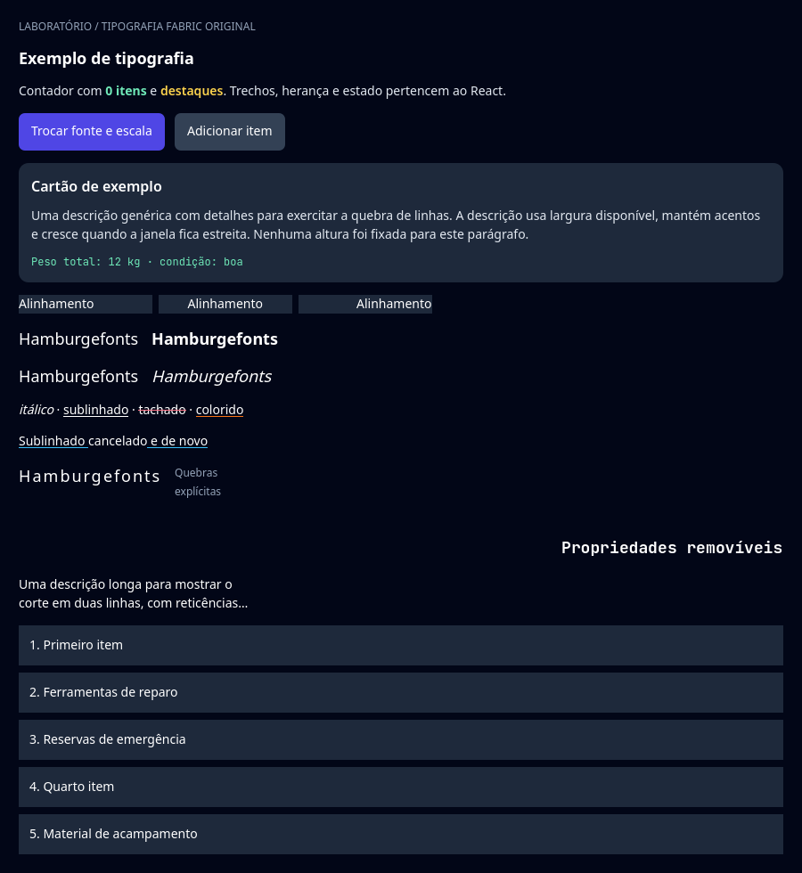
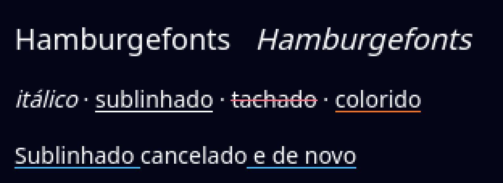
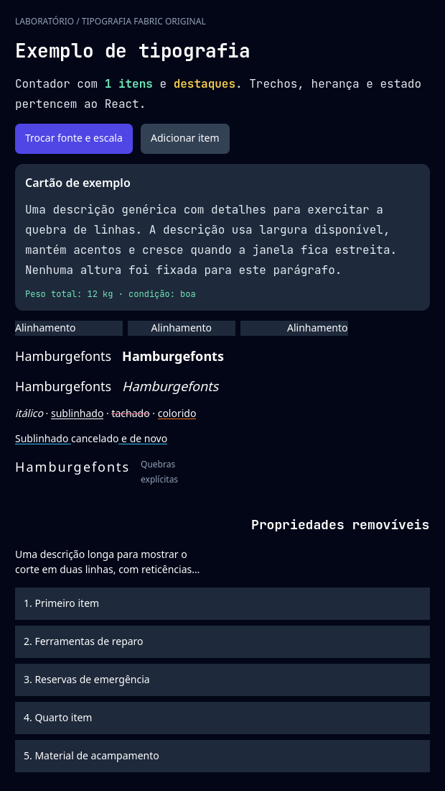

# Rich text and variable fonts

[Application](App.jsx) · [Godot scene](scene.tscn) · [Examples index](../README.md)

Increment child state, change fonts, reset it and resize the window. Compare
nested colored spans, regular/bold text, upright and italic text, a line of italic,
underline, line-through and colored decoration with a span that cancels its parent's
underline, wrapping, clipped text and scrolling.

## Run

From the repository root after `npm run setup`:

```sh
npm run example -- typography
npm run example -- typography --headless
npm run example -- typography --capture
```

The first command opens the UI; the others validate and exit. Edit `App.jsx`,
close the window and rerun to rebuild. Reports use `build/report.json`.
Captures use `build/typography-*.png` (renderer readbacks). Retained public results
are in [evidence](../../docs/evidence/README.md).

## Contract and validation

Public rich Text/View/Pressable/ScrollView with NativeWind; internal Button
and diagnostic probes are also used. Inline attachments and full selectable/
bidi/accessibility behavior are not certified.

Distinct rendered colors/variable-font weight, wrapping/truncation, empty and
trailing lines, line heights, retained child state and balanced native cleanup.

The text style ([evidence](../../docs/evidence/text-style/README.md), [research](../../docs/research/text-style.md)) is written with NativeWind
classes (`italic`, `underline`, `line-through`, `decoration-*`) and one style prop
(`textDecorationLine: "none"` on the span that cancels). Headless, it checks that the italic
run says italic and synthetic, measures exactly like the upright one, that each decorated run
has one line, in the text color or in the color of `textDecorationColor`, and that the
cancelling span leaves a gap in its parent's underline. With the renderer, it reads pixels: the
ink of the italic paragraph leans to the right of the upright one's, the orange underline is on
the row the host reported and on no other, the rose strike-through is in the middle of its
span's box, and the sky underline stops under the cancelling span and starts again after it.
A `textDecorationStyle` of `dotted` is one of the four cases the example rejects before the
native layout (the font, an inline view, a middle ellipsis and the dotted line). The italic is
synthetic, and the lines follow Godot's font metrics, not either platform's.
The native checks additionally require the acceptance marker and reject script
errors, runtime errors, crashes and timeouts. Generated reports are local and
are overwritten by another individual check.

## Renderer captures

These are Godot Viewport readbacks from the [current validation record](../../docs/evidence/public-controls/README.md).


### Text style

The italic and decoration rows, from the [text style record](../../docs/evidence/text-style/README.md) (Godot Viewport
readbacks pinned to its commit, each checked against what the host reported):






