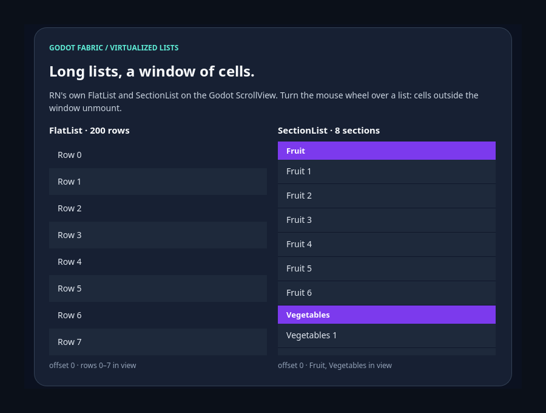

# Virtualized lists on the Godot ScrollView

```sh
npm run example -- virtualized-list
npm run example -- virtualized-list --headless
npm run example -- virtualized-list --capture
npm run test:lists
```

React Native's original `FlatList`, `SectionList`, `VirtualizedList` and
`VirtualizedSectionList` come from the public `react-native` import. They render
on the SDK ScrollView and window their cells as real Godot wheel and touch input
scrolls them. The launcher entry is the interactive demo: a 200-row `FlatList`
and a `SectionList` of eight sections side by side, each reporting its scroll
offset and what is in view. `npm run test:lists` is the
[evidence](../../docs/evidence/virtualized-list/README.md) suite, outside the
catalog: **44/44 headless checks** in two roots of one Hermes application. The
preceding host, with the same SDK bundle, fails exactly **3 normative checks**;
the preceding SDK fails 11, and an SDK ScrollView that drops `onLayout` fails 3
and is rejected by the oracle.

## Use the example



**Top** is the screen as mounted. The `FlatList` is at offset 0 with rows 0 to 7
in view, and RN has mounted a window of its 200 rows rather than all of them. The
`SectionList` is at offset 0 with its first header, Fruit, at the top and the
Vegetables header below. The two status lines come from `onScroll` and
`onViewableItemsChanged`: `offset 0 · rows 0–7 in view` and
`offset 0 · Fruit, Vegetables in view`.


**Scrolled** is the screen after real mouse wheel steps of 48 px: 30 over the
`FlatList` (offset 1,440, rows 33 to 40 in view) and 15 over the `SectionList`
(offset 720, Grains and Dairy in view, with the Dairy header on screen). The cells
that left the window were unmounted and the ones that entered it are mounted;
the status lines read `offset 1440 · rows 33–40 in view` and
`offset 720 · Grains, Dairy in view`.

## What the validation establishes

[validation.gd](validation.gd) sends actual Godot wheel input and reads the
native tree: the scroll offsets the host applied and the cells it has mounted,
with the Controls' own rectangles. It checks that each list is a native scroll
view resting at offset 0, that the `FlatList` mounts a window of its 200 rows
(React's own count matches the Controls) and that `onViewableItemsChanged`
reports the rows at least half visible, as the Controls' rectangles show them; the
`SectionList` renders its headers (Fruit at the top of the list) and its viewable
sections match the Controls. Thirty wheel steps scroll the `FlatList` 1,440 px
while the `SectionList` does not move, `onScroll` reports the offset, the window
follows it (the rows in view are mounted, the rows far from it are not, rows that
left the window unmounted while the ten initial cells stay) and every mounted row
sits at its `getItemLayout` offset minus the scroll offset. Fifteen steps then
scroll the `SectionList` 720 px while the `FlatList` keeps its offset: a later
header is in view, the viewable sections agree with the Controls and the last
section is not mounted yet. The native status text shows the same state and the
run raised no host error. With `--capture` the pixels of both lists differ
between the top and the scrolled states. The headless run passes 14 checks and
the capture run 19.

## Evidence suite

```sh
npm run test:lists
```

The same runner checks the controls. With the preceding native host installed:

```sh
node tests/virtualized-list-native.test.mjs --allow-original-negative
```

The preceding SDK and the retained sabotage need no host change:

```sh
node tests/virtualized-list-native.test.mjs --lane preceding-sdk
node tests/virtualized-list-native.test.mjs --lane sabotage
```

## Original syntax

```jsx
import {useRef} from 'react';
import {FlatList, SectionList, Text, View} from 'react-native';

const rows = Array.from({length: 120}, (_, index) => ({id: String(index)}));

function Feed({onMore}) {
  const list = useRef(null);
  return (
    <FlatList
      ref={list}
      data={rows}
      keyExtractor={row => row.id}
      getItemLayout={(_, index) => ({length: 40, offset: 40 * index, index})}
      initialNumToRender={10}
      windowSize={5}
      onEndReachedThreshold={0.5}
      onEndReached={onMore}
      viewabilityConfig={{itemVisiblePercentThreshold: 50}}
      onViewableItemsChanged={({viewableItems}) => console.log(viewableItems.length)}
      renderItem={({item}) => <Text style={{height: 40}}>{item.id}</Text>}
    />
  );
}

function Agenda({sections}) {
  return (
    <SectionList
      sections={sections}
      keyExtractor={item => item}
      renderSectionHeader={({section}) => <Text>{section.key}</Text>}
      renderItem={({item}) => <View style={{height: 30}} />}
    />
  );
}
```

Scroll a list with `list.current.scrollToIndex({index: 60, animated: false})`,
`scrollToOffset` or `scrollToEnd({animated: false})`; `SectionList` adds
`scrollToLocation`. Without `getItemLayout`, an index beyond the measured cells
calls `onScrollToIndexFailed`, as in RN.

| Input | What the list does |
| --- | --- |
| Wheel step | Scrolls 48 px in the list's own coordinates, then renders the new window |
| Touch drag | The content follows the finger, inverted lists included |
| `scrollEventThrottle` | Android's rule: an event is dropped while the throttle is at least max(17 ms, time since the last) |

## Limits

Animated scrolling is not implemented: a scroll command without `animated`
jumps where RN animates, `animated: true` throws, and so does `scrollToEnd()`
without arguments. Momentum events are never sent. Sticky section headers,
`RefreshControl`/`onRefresh`, `maintainVisibleContentPosition` and scroll
indicators throw when requested. A wheel step on an inverted list moves the
content the opposite way from an ordinary list, as Android's native scroll
views do. Nested lists of the same orientation, `initialScrollIndex`,
`numColumns`, horizontal RTL, the 10,000-row performance acceptance, real touch
hardware and mobile exports require separate acceptance. See the
[research](../../docs/research/virtualized-list.md).
